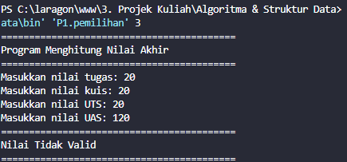
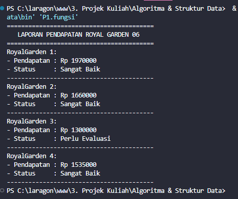
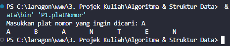

|            | Algorithm and Data Structure                                          |
| ---------- | --------------------------------------------------------------------- |
| NIM        | 254107020055                                                          |
| Nama       | Caesar Vior Byrnanda                                                  |
| Kelas      | TI - 1F                                                               |
| Repository | [link] (https://github.com/CaesarVior/PrakASD_1F_06/tree/main/src/P1) |

# JobSheet 1 #1 KONSEP DASAR PEMROGRAMAN

## 2.21 Praktikum Pemilihan

## 2.22 Praktikum Perulangan

## 2.23 Praktikum Arrays

## 2.24 Praktikum Fungsi

## 2.25 Tugas Plat Nomor

## 2.26 Tugas Plat Nomor

## 2.27 Tugas Jadwal Kuliah

