|            | Algorithm and Data Structure                                            |
| ---------- | ----------------------------------------------------------------------- |
| NIM        | 254107020055                                                            |
| Nama       | Caesar Vior Byrnanda                                                    |
| Kelas      | TI - 1F                                                                 |
| Repository | https://github.com/CaesarVior/PrakASD_1F_06/blob/main/src/P10/REPORT.md |

# JOBSHEET X QUEUE

# Percobaan 1

# Hasil Percobaan

### Class Queue06

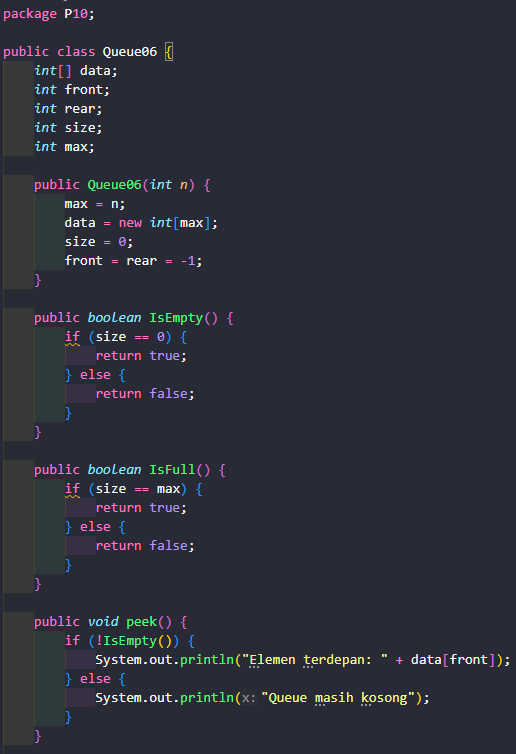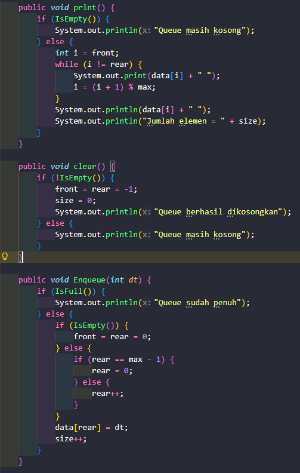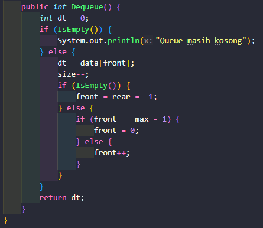

### Class Utama (Main)

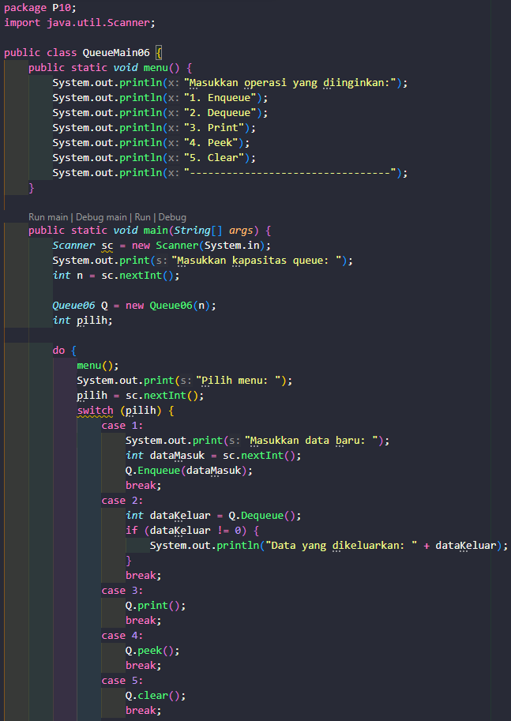
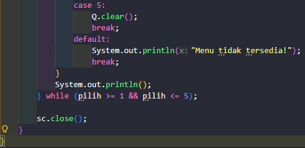

# Hasil Running

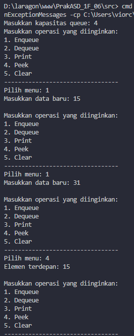

## Pertanyaan

### 1. Pada konstruktor, mengapa nilai awal atribut front dan rear bernilai -1, sementara atribut size bernilai 0?

Karena saat objek Queue baru dibuat, antrian masih kosong dan belum diisi oleh elemen satu pun. Sehingga, Atribut front dan rear diberikan nilai awal -1 sebagai tanda bahwa antrian saat itu belum menunjuk ke indeks array mana pun (kosong)

### 2. Pada method Enqueue, jelaskan maksud dan kegunaan dari potongan kode berikut!

Potongan kode tersebut digunakan ketika antrian memiliki maksimal kapasitas 5 tempat. Ketika data sudah berada di rear atau dipaling ujung data, maka data baru akan diletakkan di posisi 0 atau paling depan. Tetapi tidak akan mempengaruhi antrian

### 3. Pada method Dequeue, jelaskan maksud dan kegunaan dari potongan kode berikut!

Jika posisi paling ujung dari maksimal kapasitas 5 tempat. Maka, urutan terdepan akan dipindah lagi ke 0.

### 4. Pada method print, mengapa pada proses perulangan variabel i tidak dimulai dari 0 (int i = 0), melainkan int i = front?

Karena queue memiliki konsep First in First Out (FIFO), posisi front atau antrian tidak selalu berada di posisi 0. Maka dari itu "i" tidak mulai dari 0 tapi mulai dari front

### 5. Perhatikan kembali method print, jelaskan maksud dari potongan kode berikut!

Method print disitu digunakan untuk mengeprint data ketika front nya tidak berada di posisi 0. Misalkan, memiliki 5 tempat berarti menggunakan menggunakan rumus (4 + 1) % 5 hasilnya adalah 0. Jadi, posisi i akan dikembalikan ke 0 agar terus mencetak data sampai kondisi (i != rear) bernilai false.

### 6. Tunjukkan potongan kode program yang merupakan queue overflow!

`        if (IsFull()) {
            System.out.println("Queue sudah penuh");
        }`

### 7. Lakukan modifikasi program sehingga pada saat terjadi queue overflow (antrian penuh) dan queue underflow (antrian kosong), program langsung dihentikan!

## 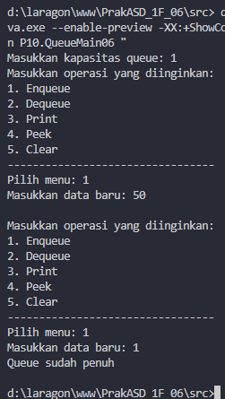

## 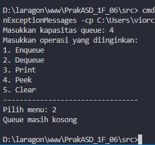

# Percobaan 2

### Class Mahasiswa06

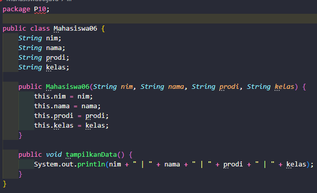

### Class Mahasiswa06

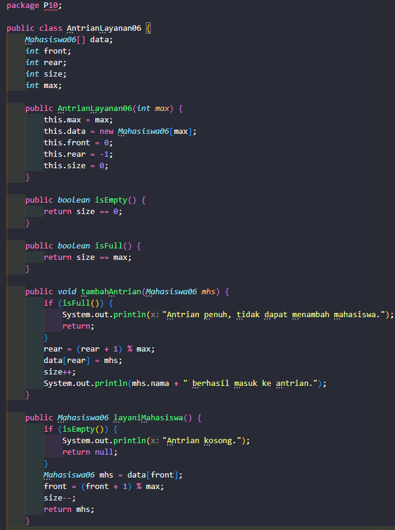
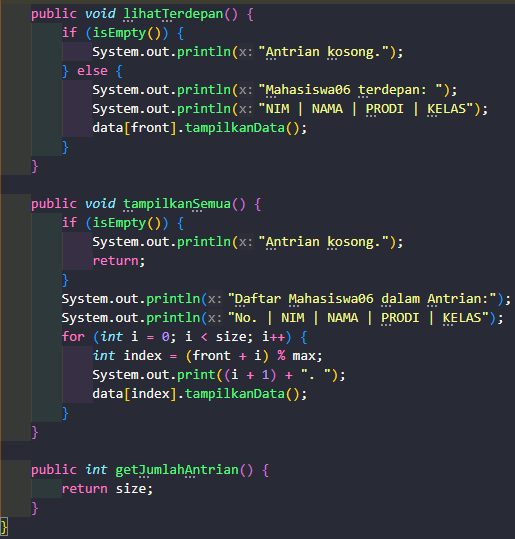

### Class Utama (Main)

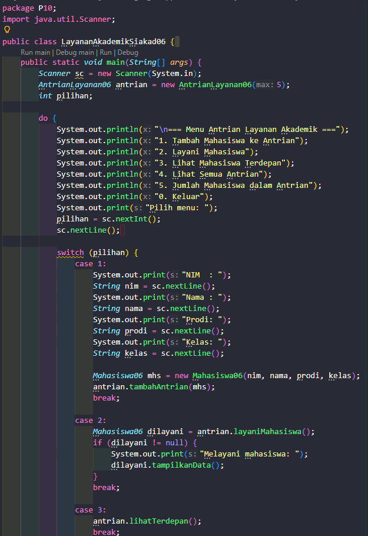
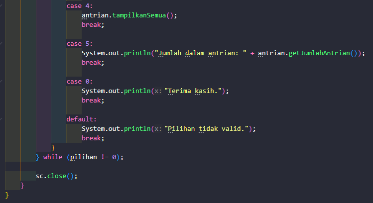

# Hasil Running

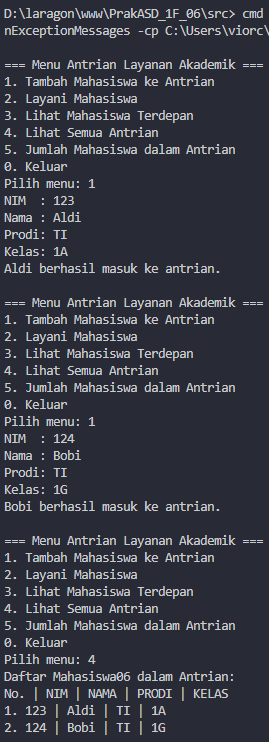
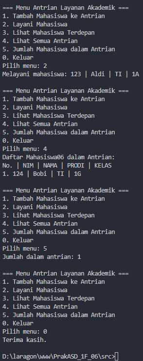
