|            | Algorithm and Data Structure                                            |
| ---------- | ----------------------------------------------------------------------- |
| NIM        | 254107020055                                                            |
| Nama       | Caesar Vior Byrnanda                                                    |
| Kelas      | TI - 1F                                                                 |
| Repository | https://github.com/CaesarVior/PrakASD_1F_06/blob/main/src/P10/REPORT.md |

# JOBSHEET XI SingleLinkedList

# Percobaan 1

### Class Mahasiswa

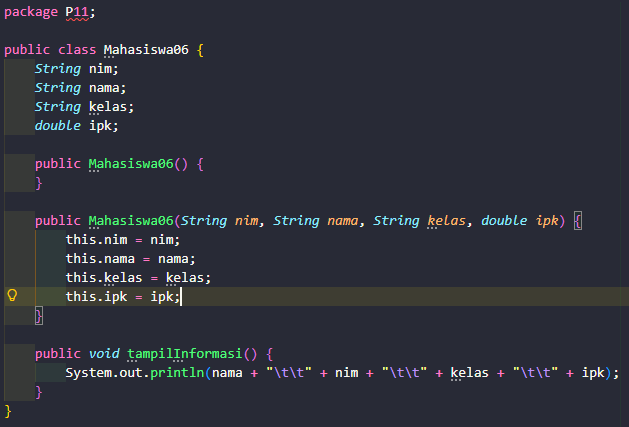

### Class Node

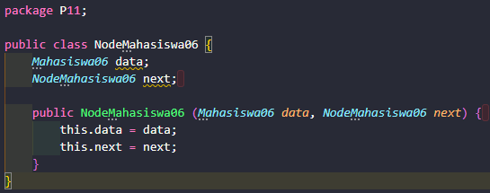

### Class SingleLinkedList

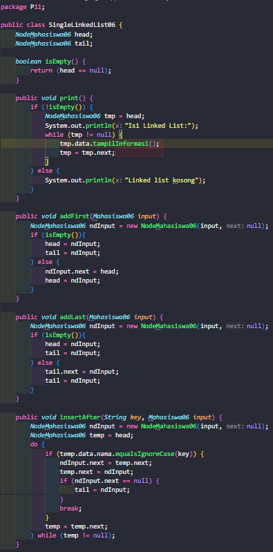
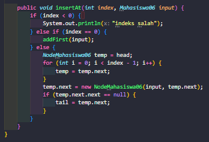

### Class Utama (Main)

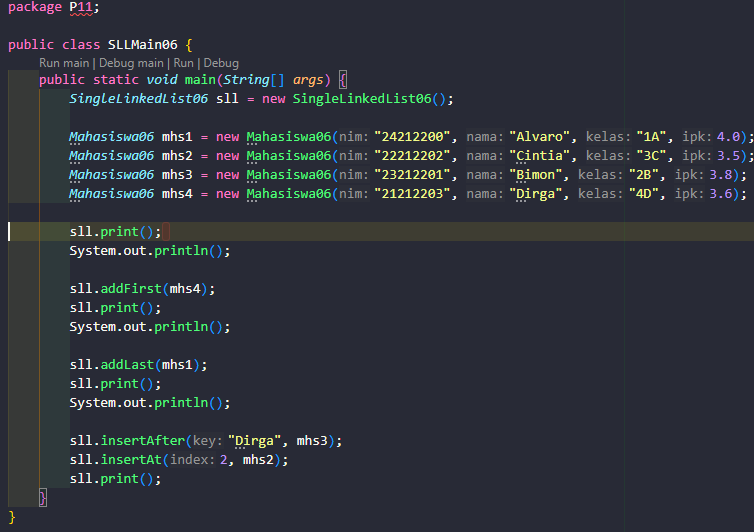

# Hasil Running

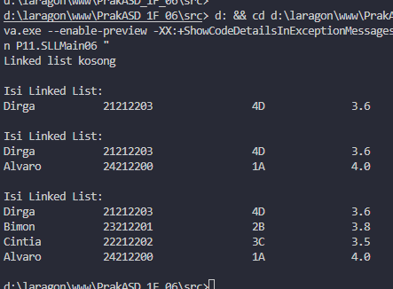

## Pertanyaan

### 1. Mengapa hasil compile kode program di baris pertama menghasilkan "Linked list kosong"?

Karena pada baris pertama, program baru membuat wadah Linked List baru dan belum ada data mahasiswa sama sekali yang dimasukkan ke dalamnya. Karena datanya masih kosong (head == null), program otomatis mendeteksi kondisi tersebut dan mencetak tulisan "Linked list kosong"

### 2. Jelaskan kegunaan variable temp secara umum pada setiap method!

Variabel temp (atau tmp) berguna sebagai penanda jalan sementara. Karena program harus berjalan lewat depan (head) satu per satu yang dipakai untuk bergeser dari satu data ke data berikutnya tanpa merusak urutan asli Linked List tersebut.

### 3. Lakukan modifikasi agar data dapat ditambahkan dari keyboard!

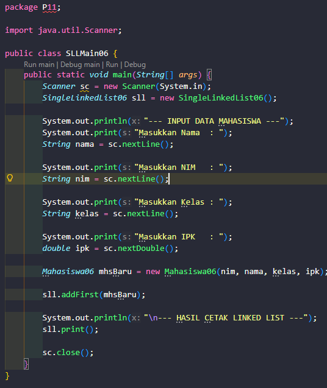
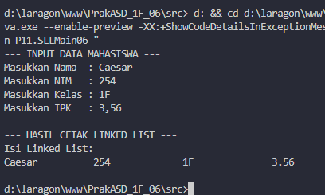

# Percobaan 2

# Hasil Percobaan

### Class SingleLinkedList

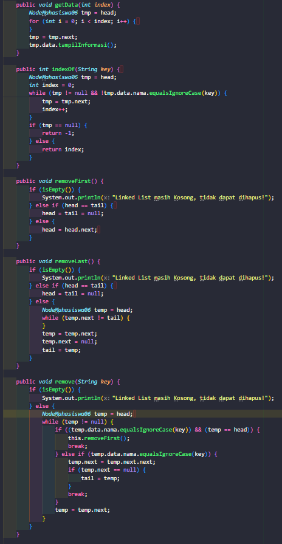
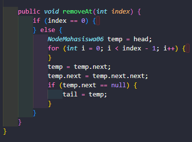

### Class Utama (Main)

# Hasil Running

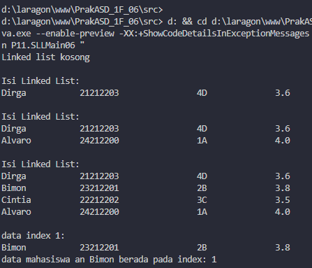

## Pertanyaan

### 1. Mengapa digunakan keyword break pada fungsi remove? Jelaskan!

Keyword break digunakan untuk menghentikan perulangan (looping) secara paksa. Karena tujuan utama dari method remove adalah mencari satu data spesifik untuk dihapus, maka ketika data yang dicari sudah ketemu dan sukses dihapus, perulangan tidak perlu lagi dilanjutkan sampai ke ujung paling belakang Linked List.

### 2. Jelaskan kegunaan kode dibawah pada method remove!

Baris temp.next = temp.next.next; Kegunaannya adalah untuk melompati objek node yang ingin dihapus. Rantai penghubung dari posisi node saat ini (temp) langsung disambungkan ke node setelah target (cucunya), sehingga node target otomatis terlepas dari rangkaian Linked List dan terhapus.

# Tugas

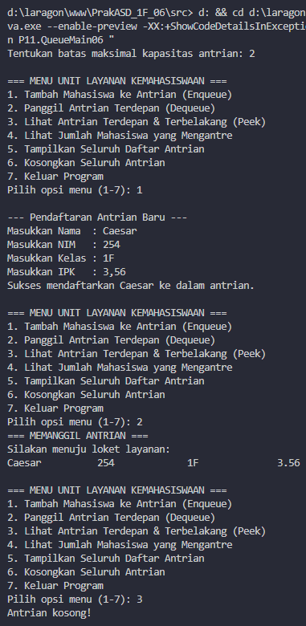
