|            | Algorithm and Data Structure                                            |
| ---------- | ----------------------------------------------------------------------- |
| NIM        | 254107020055                                                            |
| Nama       | Caesar Vior Byrnanda                                                    |
| Kelas      | TI - 1F                                                                 |
| Repository | https://github.com/CaesarVior/PrakASD_1F_06/blob/main/src/P12/REPORT.md |

# JOBSHEET XII DoubleLinkedList

# Percobaan 1

### Class Mahasiswa

### Class Node

### Class DoubleLinkedList

C

### Class Utama (Main)

# Hasil Running

## Pertanyaan

### 1. Jelaskan perbedaan struktur dan mekanisme traversal antara Single Linked List dan Double Linked List!

Single Linked List, setiap node hanya memiliki satu buah pointer (next) yang menyimpan alamat node berikutnya. Sedangkan pada Double Linked List, setiap node memiliki dua buah pointer, yaitu next dan prev

### 2. Perhatikan class Node, di dalamnya terdapat atribut next dan prev. Jelaskan fungsi masing-masing atribut tersebut pada proses traversal dan manipulasi node!

Atribut next berfungsi untuk menyimpan referensi atau alamat memori dari node setelahnya. Sedangkan, Atribut prev: Berfungsi untuk menyimpan referensi atau alamat memori dari node sebelumnya.

### 3. Perhatikan konstruktor pada class DoubleLinkedList. Jelaskan fungsi konstruktor tersebut terhadap kondisi awal linked list!

Konstruktor digunakan untuk menginisialisasi kondisi awal bahwa Linked List yang baru dibuat berada dalam keadaan kosong

### 4. Mengapa head dan tail harus menunjuk node yang sama ketika linked list masih kosong?

Ketika sebuah linked list dalam kondisi kosong (isEmpty() == true) dimasukkan sebuah data baru, maka node baru tersebut otomatis menjadi satu-satunya elemen di dalam list.

### 5. Modifikasi method print() agar menampilkan pesan "Linked List masih kosong" ketika tidak terdapat data pada linked list!

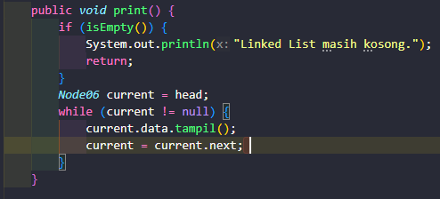

### 6. Modifikasi kode program dengan menambahkan method printReverse() untuk menampilkan seluruh data pada Double Linked List secara terbalik, dimulai dari node tail menuju head!

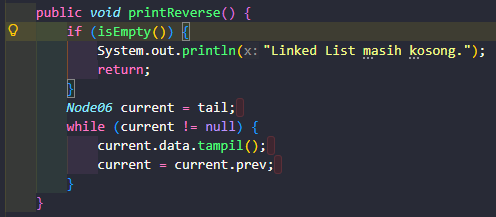

# Percobaan 1

### Class Mahasiswa

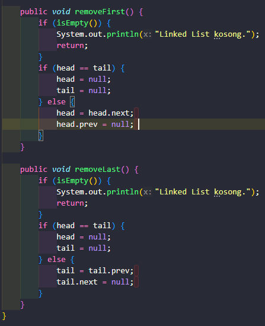

# Hasil Running

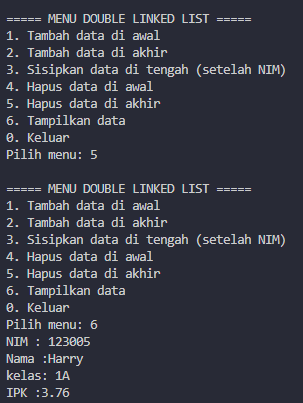

## Pertanyaan

### 1. Jelaskan fungsi masing-masing statement tersebut pada proses penghapusan node!

head = head.next berfungsi untuk memindahkan pointer head maju ke node setelahnya. Sedangkan, head.prev = null; b erfungsi untuk memutus hubungan pointer mundur (prev) milik node depan yang baru agar menunjuk ke null

### 2. Modifikasi method removeFirst() dan removeLast() agar program menampilkan data yang berhasil dihapus!

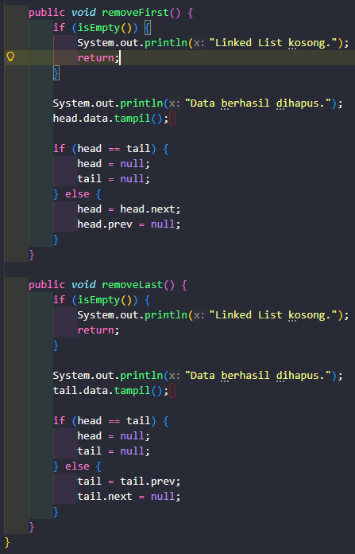

## Tugas

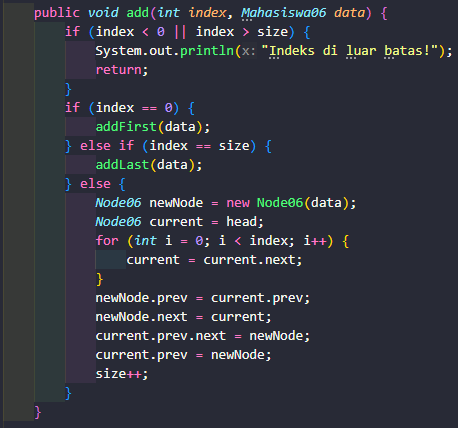
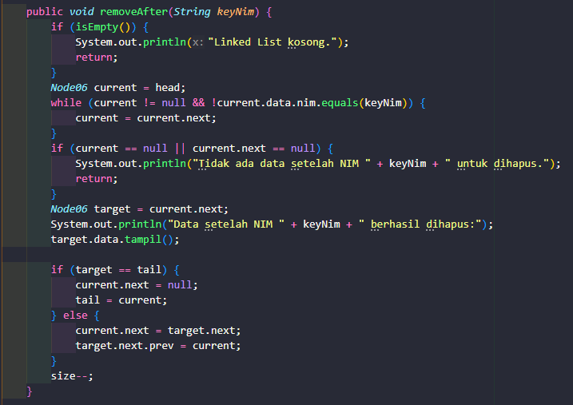
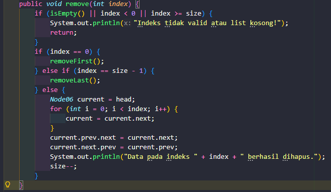
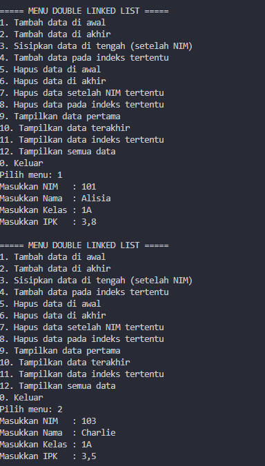
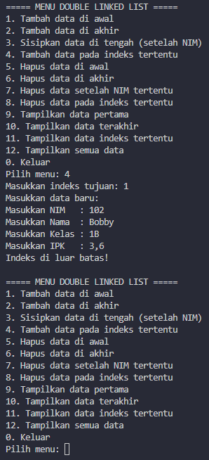
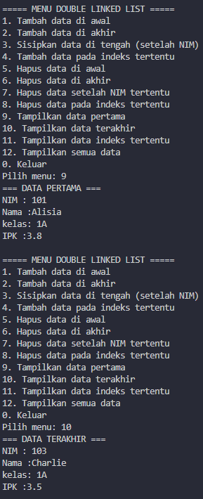
