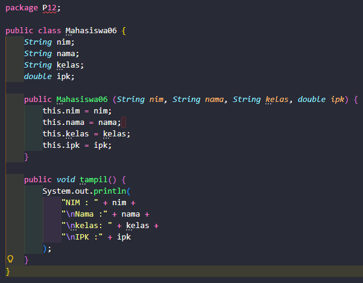
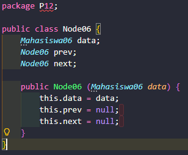
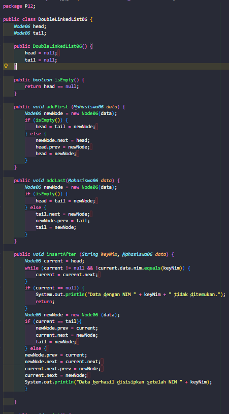
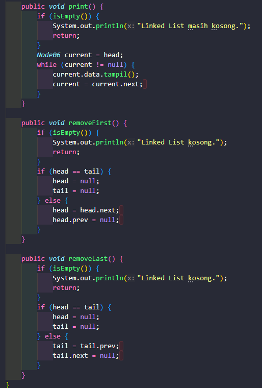
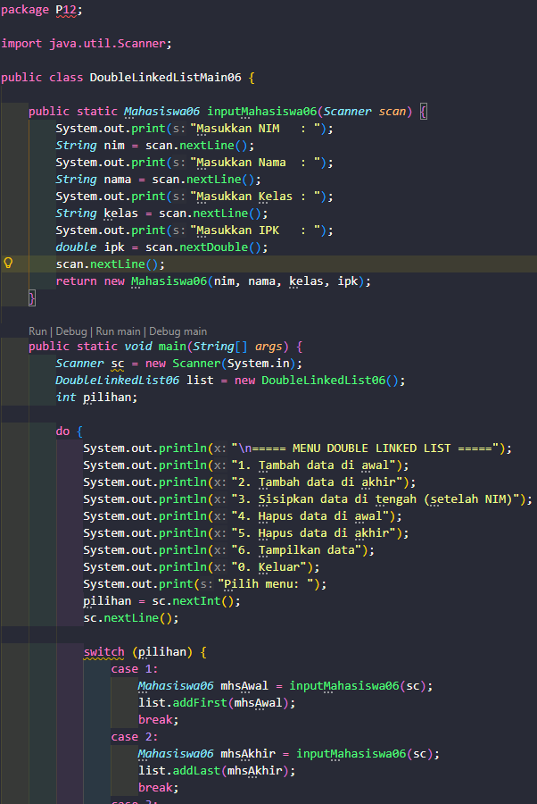
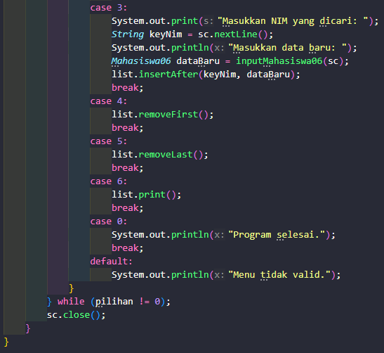
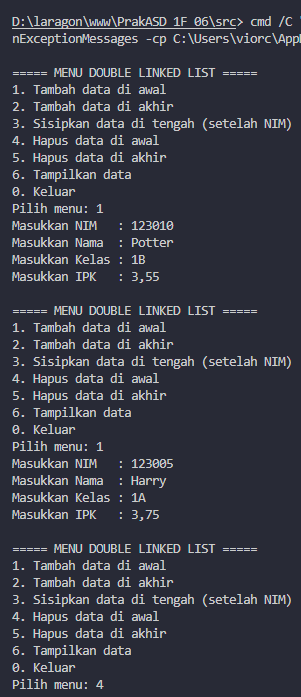
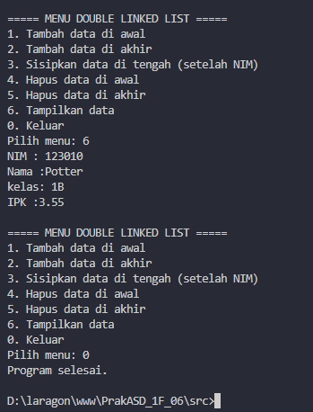

|            | Algorithm and Data Structure                                            |
| ---------- | ----------------------------------------------------------------------- |
| NIM        | 254107020055                                                            |
| Nama       | Caesar Vior Byrnanda                                                    |
| Kelas      | TI - 1F                                                                 |
| Repository | https://github.com/CaesarVior/PrakASD_1F_06/blob/main/src/P12/REPORT.md |

# JOBSHEET XII DoubleLinkedList

# Percobaan 1

### Class Mahasiswa

### Class Node

### Class DoubleLinkedList

### Class Utama (Main)

# Hasil Running

