|            | Algorithm and Data Structure                                            |
| ---------- | ----------------------------------------------------------------------- |
| NIM        | 254107020055                                                            |
| Nama       | Caesar Vior Byrnanda                                                    |
| Kelas      | TI - 1F                                                                 |
| Repository | https://github.com/CaesarVior/PrakASD_1F_06/blob/main/src/P14/REPORT.md |

# JOBSHEET XIV Tree

# Percobaan 1

### Class Mahasiswa

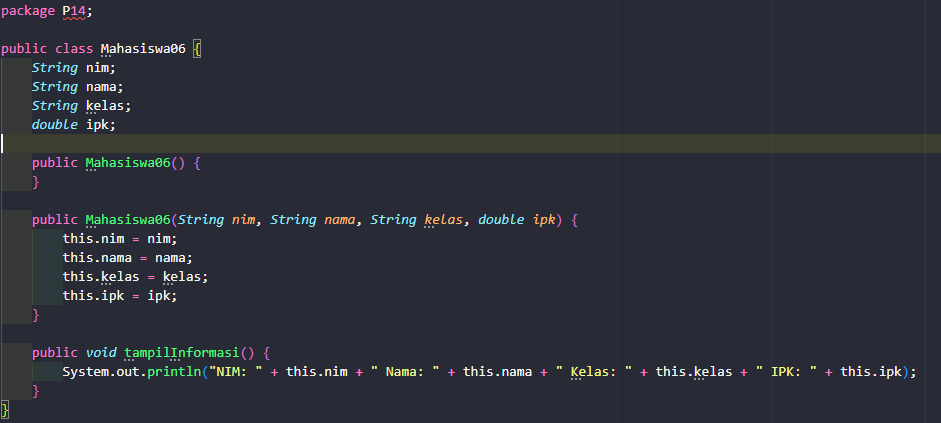

### Class Node

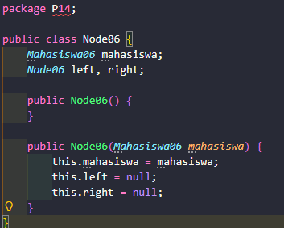

### Class BinaryTree

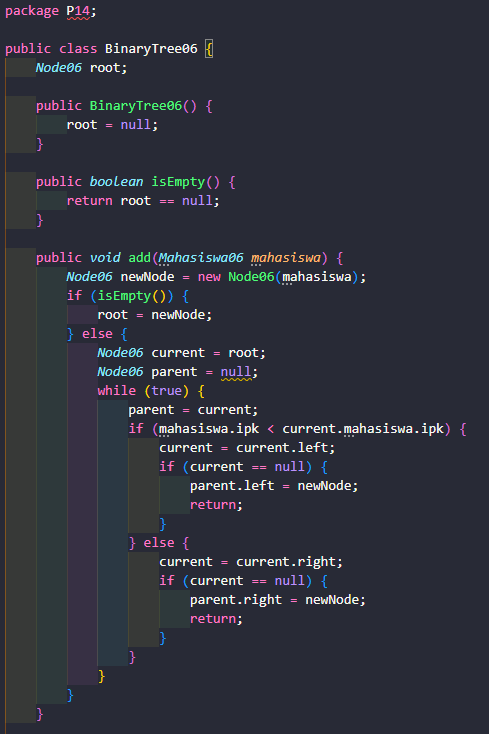
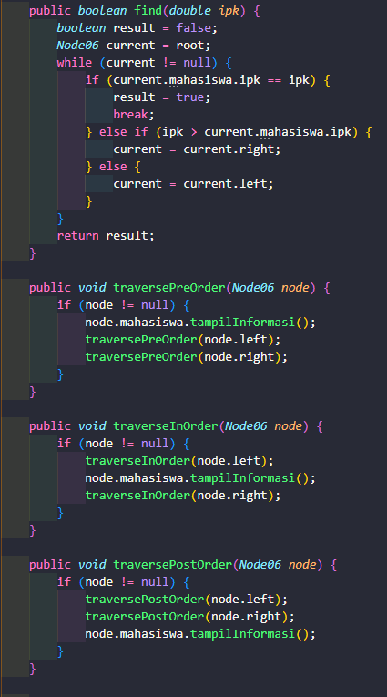
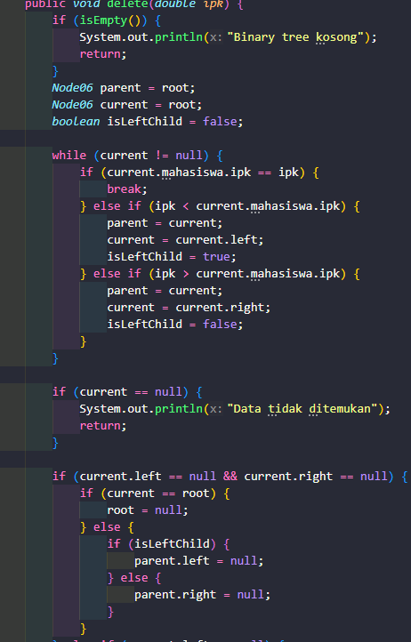
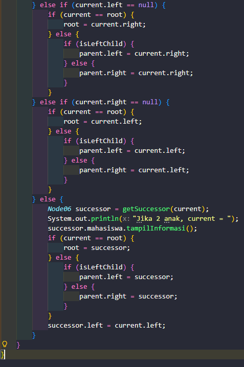

### Class Utama (Main)

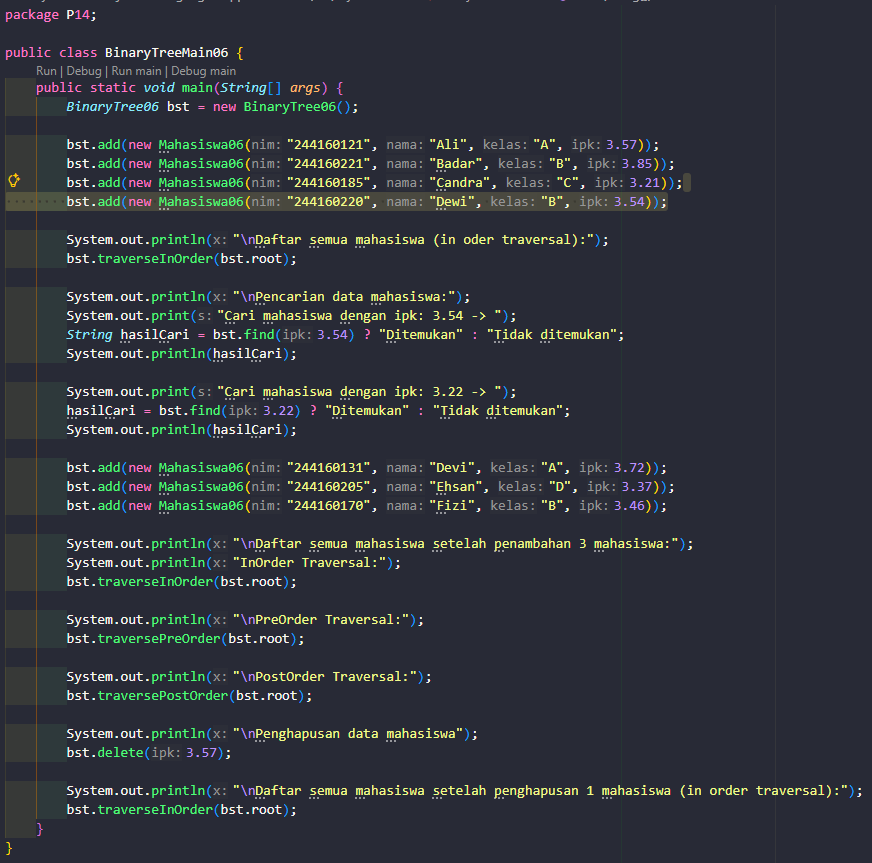

# Hasil Running

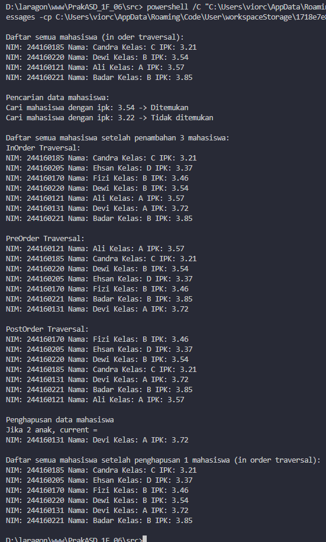

## Pertanyaan

### 1. Mengapa dalam binary search tree proses pencarian data bisa lebih efektif dilakukan dibanding binary tree biasa?

Pencarian lebih efektif karena data sudah terurut rapi sehingga program bisa langsung memilih jalur kiri atau kanan tanpa memeriksa seluruh isi pohon satu per satu.

### 2. Untuk apakah di class Node, kegunaan dari atribut left dan right?

Atribut left dan right berguna sebagai penunjuk untuk menghubungkan node saat ini dengan cabang anak di sebelah kiri dan anak di sebelah kanan.

### 3. a. Untuk apakah kegunaan dari atribut root di dalam class BinaryTree? b. Ketika objek tree pertama kali dibuat, apakah nilai dari root?

a. Atribut root berguna sebagai pintu masuk utama atau fondasi teratas untuk memulai semua operasi pada pohon biner.
b. Nilai awal root saat objek pertama kali dibuat adalah kosong atau null.

### 4. Ketika tree masih kosong, dan akan ditambahkan sebuah node baru, proses apa yang akan terjadi?

Proses saat pohon kosong adalah node baru yang pertama kali dimasukkan akan langsung diangkat menjadi node utama atau root.

### 5. Perhatikan method add(), di dalamnya terdapat baris program seperti di bawah ini. Jelaskan secara detil untuk apa baris program tersebut?

Baris program tersebut berfungsi untuk membandingkan nilai data baru agar bisa turun mencari posisi cabang yang kosong lalu menempatkannya di sana.

### 6. Jelaskan langkah-langkah pada method delete() saat menghapus sebuah node yang memiliki dua anak. Bagaimana method getSuccessor() membantu dalam proses ini?

Langkah penghapusan dua anak dilakukan dengan mencari node pengganti yang paling pas dari cabang kanan menggunakan bantuan method getSuccessor() agar struktur pohon tetap rapi

# Percobaan 2

### Class BinaryTreeArray

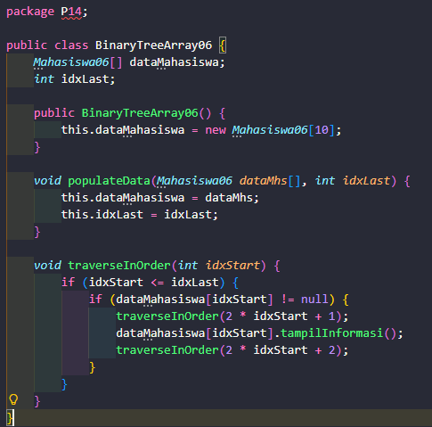

### Class Utama

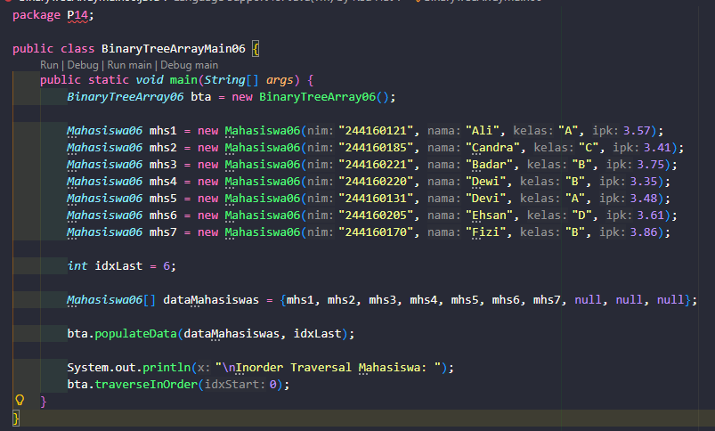

# Hasil Running

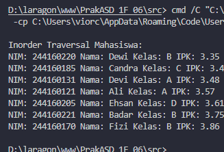

## Pertanyaan

### 1. Apakah kegunaan dari atribut data dan idxLast yang ada di class BinaryTreeArray?

Atribut dataMahasiswa dan idxLast berguna untuk menyimpan kumpulan objek mahasiswa ke dalam array beserta penanda batas indeks terakhir data yang valid.

### 2. Apakah kegunaan dari method populateData()?

Method populateData() berguna untuk memasukkan atau menyalin sekumpulan data mahasiswa dan batas indeksnya dari program utama ke dalam class tree array.

### 3. Apakah kegunaan dari method traverseInOrder()?

Method traverseInOrder() berguna untuk menjelajahi dan menampilkan informasi data mahasiswa dari pohon biner dengan urutan kiri, induk, lalu kanan.

### 4. Jika suatu node binary tree disimpan dalam array indeks 2, maka di indeks berapakah posisi left child dan right child masing-masing?

Jika induk berada di indeks 2, maka posisi left child ada di indeks 5 dan right child ada di indeks 6.

### 5. Apa kegunaan statement int idxLast = 6 pada praktikum 2 percobaan nomor 4?

Statement int idxLast = 6 berguna untuk membatasi proses pembacaan agar program tahu bahwa data mahasiswa yang valid hanya tersedia sampai indeks ke-6 di dalam array.

### 6. Mengapa indeks 2*idxStart+1 dan 2*idxStart+2 digunakan dalam pemanggilan rekursif, dan apa kaitannya dengan struktur pohon biner yang disusun dalam array?

Indeks rumus tersebut digunakan karena merupakan aturan baku pemetaan pohon biner ke array, di mana anak kiri selalu berada di nomor ganjil dan anak kanan di nomor genap setelah posisi induknya.
