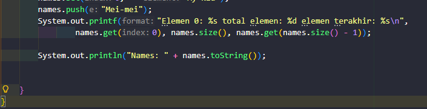
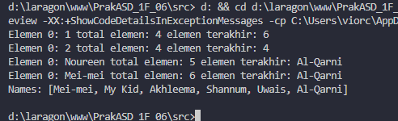

|            | Algorithm and Data Structure                                            |
| ---------- | ----------------------------------------------------------------------- |
| NIM        | 254107020055                                                            |
| Nama       | Caesar Vior Byrnanda                                                    |
| Kelas      | TI - 1F                                                                 |
| Repository | https://github.com/CaesarVior/PrakASD_1F_06/blob/main/src/P15/REPORT.md |

# JOBSHEET XV Collection Framework

# Percobaan 1

### Class ContohList

# Hasil Running

## Pertanyaan

### 1. Perhatikan baris kode 25-36, mengapa semua jenis data bisa ditampung ke dalam sebuah Arraylist?

Class ArrayList berbasis array dinamis yang unggul dalam kecepatan mengakses data, sedangkan LinkedList berbasis simpul berantai yang unggul dalam kecepatan menambah atau menghapus data di tengah list.

### 2. Modifikasi baris kode 25-36 seingga data yang ditampung hanya satu jenis atau spesifik tipe tertentu!

Hasilnya adalah seperti pada gambar diatas. Sehingga, ketika data isi dengan tipe data lain tidak bisa

### 3. Ubah kode pada baris kode 38 menjadi seperti ini

Hasilnya adalah seperti pada gambar diatas.

### 4. Tambahkan juga baris berikut ini, untuk memberikan perbedaan dari tampilan yang sebelumnya

Hasilnya adalah seperti pada gambar diatas. Sehingga hasilnya akan seperti itu

### 5. Dari penambahan kode tersebut, silakan dijalankan dan apakah yang dapat Anda jelaskan!

Kode program tersebut menunjukkan bagaimana data dalam daftar (list) bisa ditambah, dihapus, diubah nilainya, serta disisipkan di posisi awal secara dinamis, di mana perubahan tersebut langsung memengaruhi urutan, total elemen, dan nilai elemen pertama atau terakhir saat dicetak
