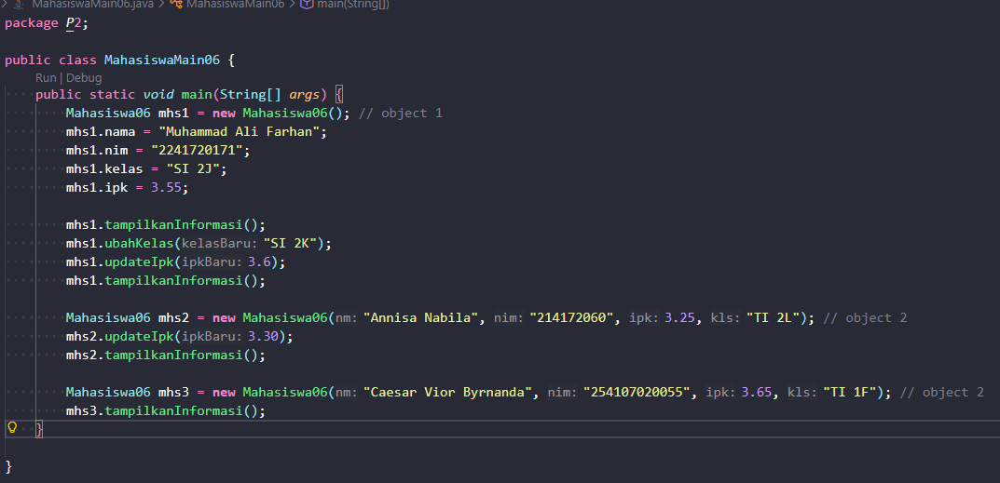
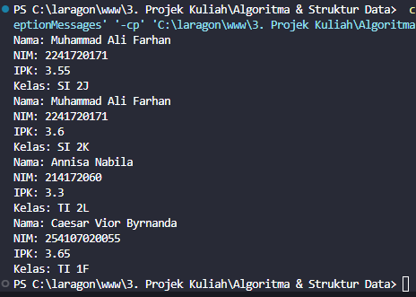
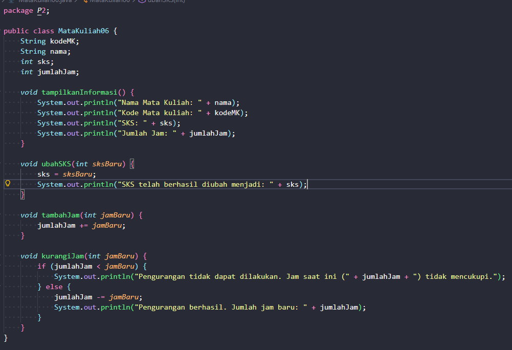
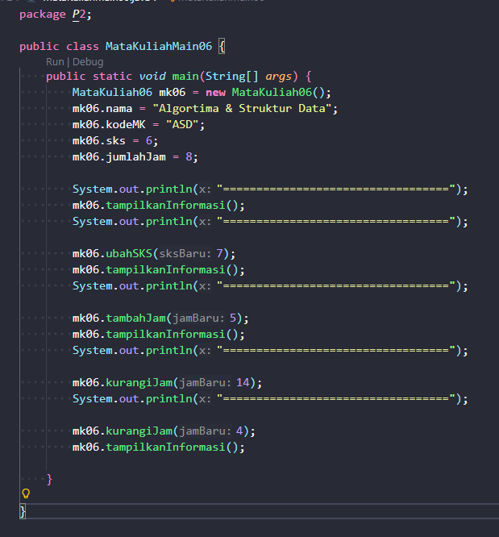
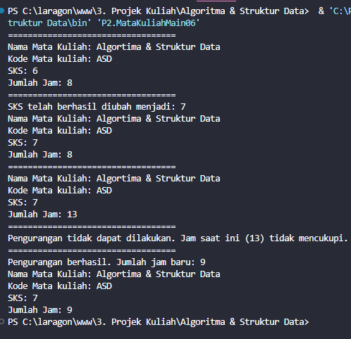
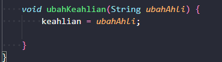
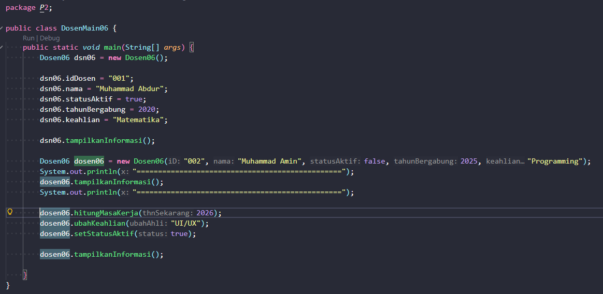

|            | Algorithm and Data Structure |
| ---------- | ---------------------------- |
| NIM        | 254107020055                 |
| Nama       | Caesar Vior Byrnanda         |
| Kelas      | TI - 1F                      |
| Repository | [link] ()                    |

# JobSheet 2 #2 Object

## 2.1 Percobaan 1: Deklarasi Class, Atribut dan Method

### Percobaan


### Pertanyaan

### 1. Sebutkan dua karakteristik class atau object!

Class biasanya diawali dengan kata "class" saat inisiasi nya. Seperti

```
public class Mahasiswa06 (){}
```

Sedangkan Object, ditandai dengan "new" saat inisiasi. Jadi formatnya adalah Seperti

```
new Object
```

### 2. Perhatikan class Mahasiswa pada Praktikum 1 tersebut, ada berapa atribut yang dimiliki oleh class Mahasiswa? Sebutkan apa saja atributnya!

Ada 4 attribute yaitu `nama`, `nim`, `kelas`, `ipk`

### 3. Ada berapa method yang dimiliki oleh class tersebut? Sebutkan apa saja methodnya!

Ada 4 class yaitu `tampilkanInformasi`, `ubahKelas`, `updateIpk`, `nilaiKinerja`

### 4. Perhatikan method updateIpk() yang terdapat di dalam class Mahasiswa. Modifikasi isi method tersebut sehingga IPK yang dimasukkan valid yaitu terlebih dahulu dilakukan pengecekan apakah IPK yang dimasukkan di dalam rentang 0.0 sampai dengan 4.0 (0.0 <= IPK <= 4.0). Jika IPK tidak pada rentang tersebut maka dikeluarkan pesan: "IPK tidak valid. Harus antara 0.0 dan 4.0".


## 2.2 Percobaan 2: Instansiasi Object, serta Mengakses Atribut dan Method

### Percobaan


### Pertanyaan

### 1. Pada class MahasiswaMain, tunjukkan baris kode program yang digunakan untuk prosesinstansiasi! Apa nama object yang dihasilkan?


Instansiasi pada `Object Oriented` biasanya ditandai dengan `new`. Hal ini seperti pada percobaan 2, instansiasnya terdapat pada `Mahasiswa06 mhs1 = new Mahasiswa06();`

### 2. Bagaimana cara mengakses atribut dan method dari suatu objek?

Cara mengakses nya adalah dengan cara memanggil `namaObject.namaMethod();`. Contoh jika didalam `Mahasiswa06.java` sudah terdapat class atau template untuk mahasiswa yaitu method `tampilkanInformasi`, `ubahKelas`, `updateIpk`, dan `nilaiKerja`. Class yang ingin menggunakan function tersebut harus melakukan inisiasi seperti `Mahasiswa06 mhs1 = new Mahasiswa06();`. Baru lah class tersebut bisa menggunakan method-method yang ada di `Mahasiswa06.java`. Cara mengaksesnya seperti gambar dibawah ini:


### 3. Mengapa hasil output pemanggilan method tampilkanInformasi() pertama dan kedua berbeda?

Karena di `tampilkanInformasi()` yang pertama itu langsung mengeluarkan apa yang sudah diisikan di `namaObject.namaMethod();` untuk diiskan menjadi `atribut`. Saat` tampilkanInformasi()` yang kedua, sebelumnya itu memanggil method `mhs1.ubahKelas("TI-1G");` dan `mhs1.updateIpk(3.75);` untuk merubah atribut kelas dan ipk. Maka dari itu hasil dari `tampilkanInformasi()` ada 2 versi yaitu versi yang mengikuti `mhs1.ubahKelas("TI-1G");` dan `mhs1.updateIpk(3.75);` serta versi yang `mhs1.ubahKelas("TI-1G");` dan `mhs1.updateIpk(3.75);`

## 2.3 Percobaan 3: Membuat Konstruktor

### Percobaan


### Pertanyaan

### 1. Pada class Mahasiswa di Percobaan 3, tunjukkan baris kode program yang digunakan untuk mendeklarasikan konstruktor berparameter!


### 2. Perhatikan class MahasiswaMain. Apa sebenarnya yang dilakukan pada baris program berikut?

Yang dilakukan oleh kode tersebut itu sama dengan

```
Mahasiswa06 mhs1 = new Mahasiswa06();
mhs1.nama = "Caesar Vior Byrnanda";
mhs1.nim = "254107020055";
mhs1.kelas = "TI-1F";
mhs1.ipk = 3.65;
```

yaitu sama-sama memasukkan suatu nilai ke atribut. Perbedaanya terletak pada konstruktornya saja. Kode diatas menggunakan `konstruktor tanpa parameter`. Sedangkan gambar pada soal adalah `konstruktor berparameter`. Konstruktur berparameter lebih baik digunakan untuk menginisialisasi atribut objek dengan nilai spesifik saat objek dibuat. Sebaliknya, konstruktur tanpa parameter digunakan untuk memberikan nilai default pada suatu atribut.

### 3. Hapus konstruktor default pada class Mahasiswa, kemudian compile dan run program. Bagaimana hasilnya? Jelaskan mengapa hasilnya demikian!


Akan terjadi error seperti itu, dikarenakan `java` ketika tidak dibuatkan `konstruktor` maka dia akan membuatkan defaultnya. Nah ketika sudah dibuatkan `Konstruktor berparameter` maka java menganggap bahwa ketika konstruktor diinisialisasi harus menggunakan parameter, sedangkan pada gambar atau insialisasi pertama tidak menggunakan parameter. Sehingga dibutuhkan `konstruktor default`

```
    public Mahasiswa06() {

    }
```

### 4. Setelah melakukan instansiasi object, apakah method di dalam class Mahasiswa harus diakses secara berurutan? Jelaskan alasannya!

Method di dalam class Mahasiswa tidak harus diakses secara berurutan karena `Java` memberikan kebebasan ke semua public method setelah object terbentuk. Tetapi harus dipikirkan dalam urutan pemanggilan tetap harus diperhatikan agar tidak membingunkan developer.

### 5. Buat object baru dengan nama mhs<NamaMahasiswa> menggunakan konstruktor berparameter dari class Mahasiswa




## 2.4 Latihan Praktikum

1.  Ini adalah latihan praktikum Soal nomor 1
    
    
    
2.  Ini adalah latihan praktikum Soal nomor 2
    
    
    
    
