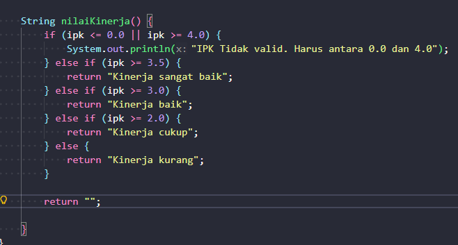

|            | Algorithm and Data Structure |
| ---------- | ---------------------------- |
| NIM        | 254107020055                 |
| Nama       | Caesar Vior Byrnanda         |
| Kelas      | TI - 1F                      |
| Repository | [link] ()                    |

# JobSheet 1 #1 KONSEP DASAR PEMROGRAMAN

# Percobaan 1:


## Pertanyaan 1:

## 1. Sebutkan dua karakteristik class atau object!

Class biasanya diawali dengan kata "class" saat inisiasi nya. Seperti

```
public class Mahasiswa06 (){}
```

Sedangkan Object, ditandai dengan "new" saat inisiasi. Jadi formatnya adalah Seperti

```
new Object
```

## 2. Perhatikan class Mahasiswa pada Praktikum 1 tersebut, ada berapa atribut yang dimiliki oleh class Mahasiswa? Sebutkan apa saja atributnya!

Ada 4 attribute yaitu `nama`, `nim`, `kelas`, `ipk`

## 3. Ada berapa method yang dimiliki oleh class tersebut? Sebutkan apa saja methodnya!

Ada 4 class yaitu `tampilkanInformasi`, `ubahKelas`, `updateIpk`, `nilaiKinerja`

## 4. Perhatikan method updateIpk() yang terdapat di dalam class Mahasiswa. Modifikasi isi method tersebut sehingga IPK yang dimasukkan valid yaitu terlebih dahulu dilakukan pengecekan apakah IPK yang dimasukkan di dalam rentang 0.0 sampai dengan 4.0 (0.0 <= IPK <= 4.0). Jika IPK tidak pada rentang tersebut maka dikeluarkan pesan: "IPK tidak valid. Harus antara 0.0 dan 4.0".


