|            | Algorithm and Data Structure                                 |
| ---------- | ------------------------------------------------------------ |
| NIM        | 254107020055                                                 |
| Nama       | Caesar Vior Byrnanda                                         |
| Kelas      | TI - 1F                                                      |
| Repository | https://github.com/CaesarVior/PrakASD_1F_06/tree/main/src/P3 |

# JobSheet 3 #3 ARRAY OF OBJECTS

# Percobaan 1:

## Screenshot kode program

Class Mahasiswa
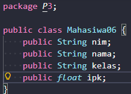

Main Mahasiswa
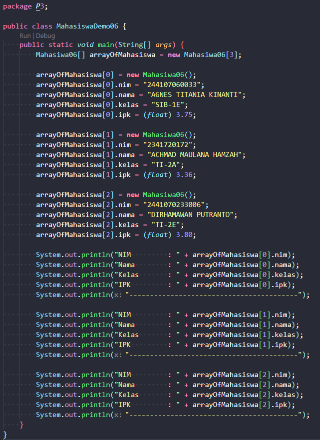

## Screenshot hasil percobaan

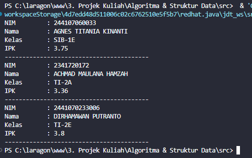

## Pertanyaan

### 1: Berdasarkan uji coba 3.2, apakah class yang akan dibuat array of object harus selalu memiliki atribut dan sekaligus method? Jelaskan!

Tidak harus memiliki keduanya secara bersamaan. Namun, sebuah class yang akan dibuat menjadi array of object idealnya memiliki atribut agar setiap objek dalam array tersebut dapat menyimpan data yang unik. Penempatan atribute diluar method berfungsi agar data tersebut bersifat permanen dalam objek dan dapat diakses oleh class lain yang membutuhkan. Misalkan, jika ingin membuat sebuah class Matakuliah. Maka atribute mahasiswa akan tetap dibutuhkan untuk merekap siapa yang mengikuti matakuliah tersebut.

### 2: Apa yang dilakukan oleh kode program berikut?

`Mahasiwa06[] arrayOfMahasiswa = new Mahasiwa06[3];`
Berfungsi untuk mendeklarasikan variabel array bernama arrayOfMahasiswa dengan tipe class Mahasiswa06, sekaligus mengalokasikan memori untuk array tersebut dengan kapasitas 3 elemen.

### 3. Apakah class Mahasiswa memiliki konstruktor? Jika tidak, kenapa bisa dilakukan pemanggilan konstruktur pada baris program berikut?

Tidak ada, karena java secara default sudah membuatkan konstruktor kosong seperti `public class Mahasiswa06() {}` yang isinya kosong. Pemanggilan `arrayOfMahasiswa[0] = new Mahasiwa06();` itu tetap bisa dilakukan karena ada konstruktor default yang dibuat oleh java.

### 4. Apa yang dilakukan oleh kode program berikut?

        arrayOfMahasiswa[0] = new Mahasiwa06();
        arrayOfMahasiswa[0].nim = "244107060033";
        arrayOfMahasiswa[0].nama = "AGNES TITANIA KINANTI";
        arrayOfMahasiswa[0].kelas = "SIB-1E";
        arrayOfMahasiswa[0].ipk = (float) 3.75;

Kode tersebut berfungsi untuk membuat objek baru dari class Mahasiswa06 dan menyimpannya ke dalam indeks 0 dari arrayOfMahasiswa serta untuk menggunakan atribute yang ada di class Mahasiswa06. Setelah objek dibuat, baris berikutnya digunakan untuk mengisi data ke dalam atribut nim, nama, kelas, dan ipk khusus untuk objek di indeks ke-0 tersebut.

### 5. Mengapa class Mahasiswa dan MahasiswaDemo dipisahkan pada uji coba 3.2?

Selain untuk mempraktikkan Array of Objects, pemisahan ini dilakukan agar terjadi pemisahan tanggung jawab atau OOP sederhana.

# Percobaan 2:

## Screenshot kode program

Class Mahasiswa

Main Mahasiswa
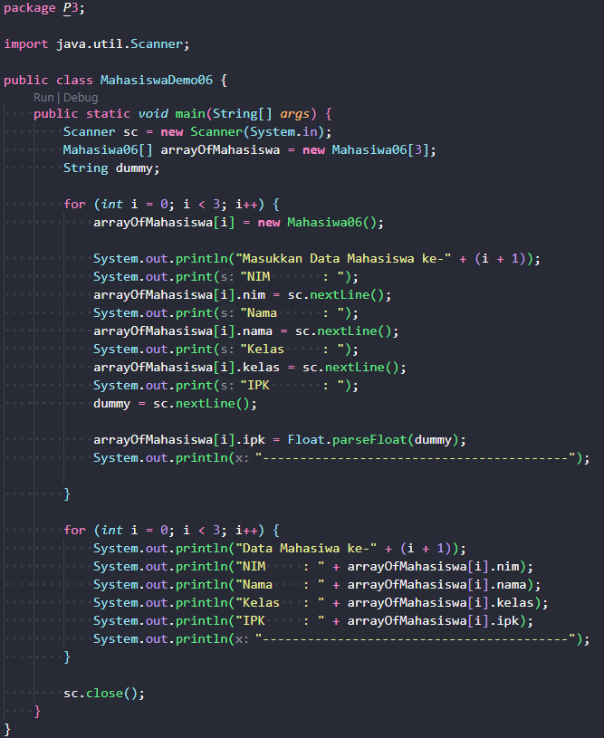

## Screenshot hasil percobaan

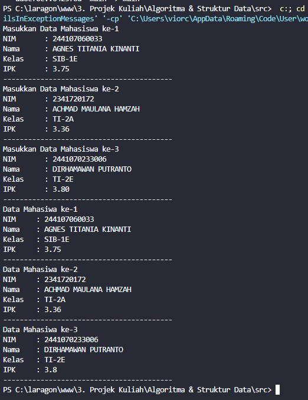

## Pertanyaan

### 1. Tambahkan method cetakInfo() pada class Mahasiswa kemudian modifikasi kode program pada langkah no 3

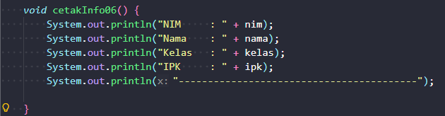
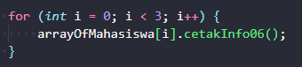

### 2. Misalkan Anda punya array baru bertipe array of Mahasiswa dengan nama myArrayOfMahasiswa. Mengapa kode berikut menyebabkan error?

Karena pada indeks ke-0 belum dilakukan inisialisasi object nya, jadi java bingung atribute nim itu didapatkan darimana. `myArrayOfMahasiswa` hanya menginisalisasi berapa banyak isi array nya.

# Percobaan 3:

## Screenshot kode program

Class Matakuliah
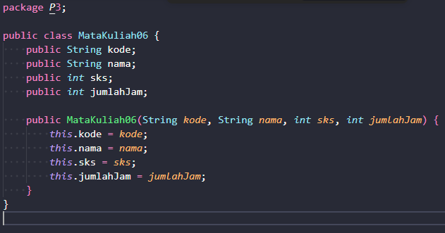

Main Matakuliah
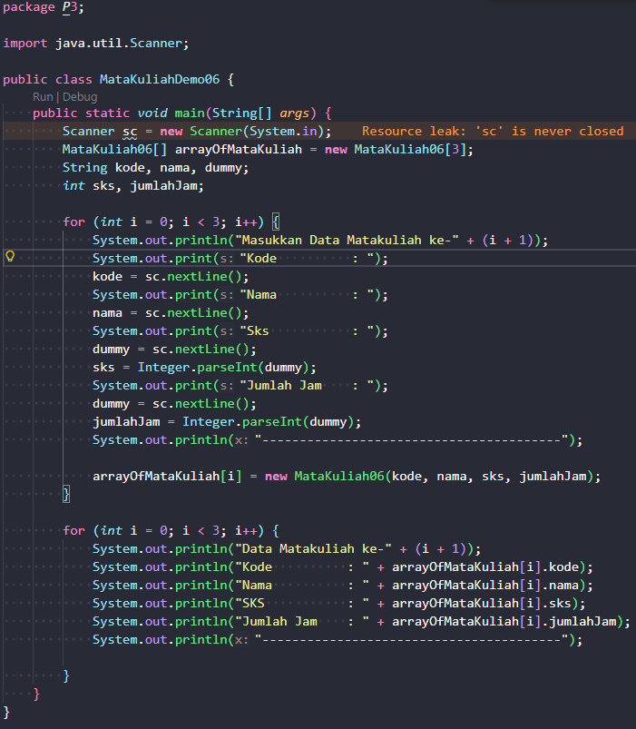

## Screenshot hasil percobaan

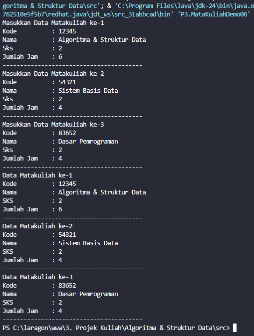

## Pertanyaan

### 1. Apakah suatu class dapat memiliki lebih dari 1 constructor? Jika iya, berikan contohnya

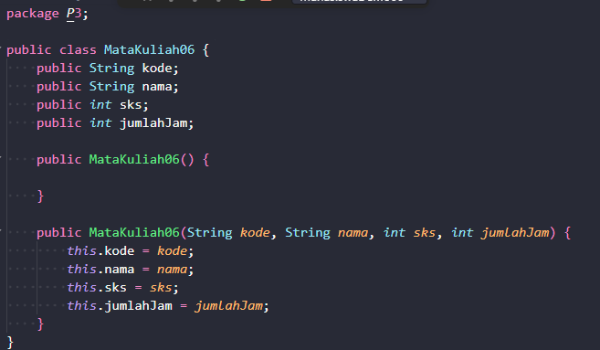

### 2. Tambahkan method tambahData() pada class Matakuliah, kemudian gunakan method tersebut di class MatakuliahDemo untuk menambahkan data Matakuliah

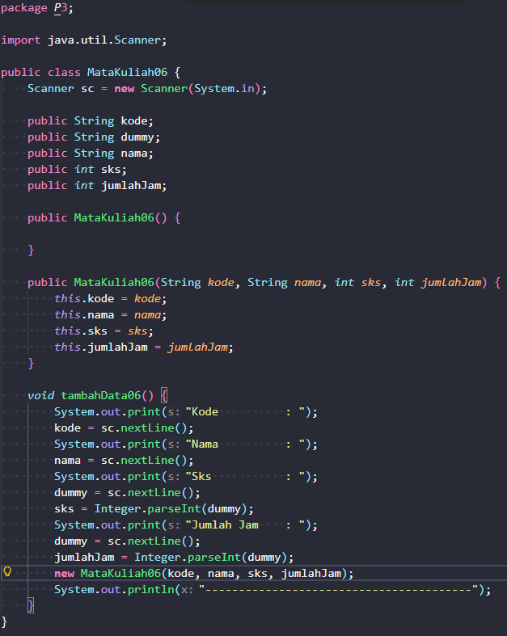 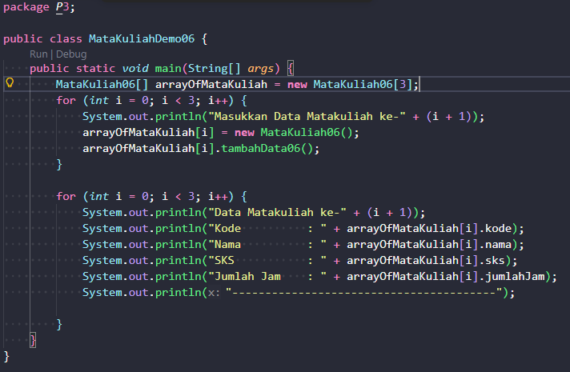
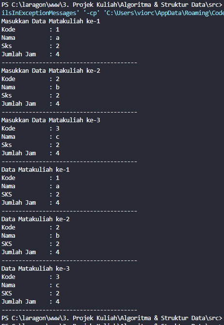

### 3. Tambahkan method cetakInfo() pada class Matakuliah, kemudian gunakan method tersebut di class MatakuliahDemo untuk menampilkan data hasil inputan di layar

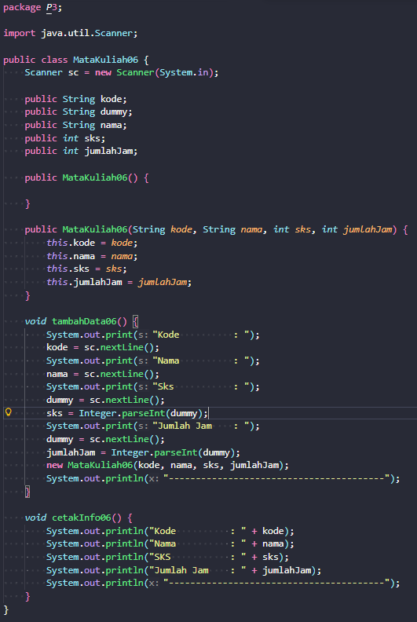 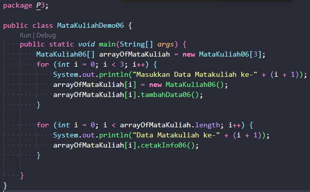
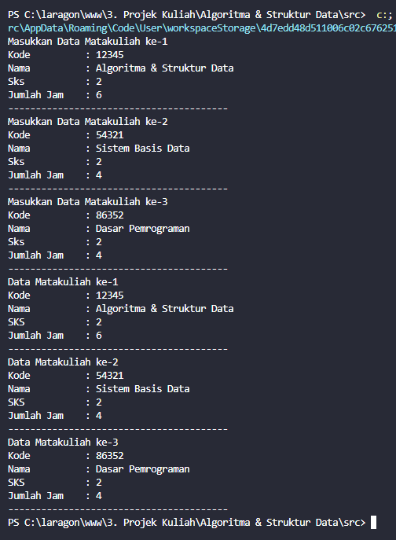

### 4. Modifikasi kode program pada class MatakuliahDemo agar panjang (jumlah elemen) dariarray of object Matakuliah ditentukan oleh user melalui input dengan Scanner

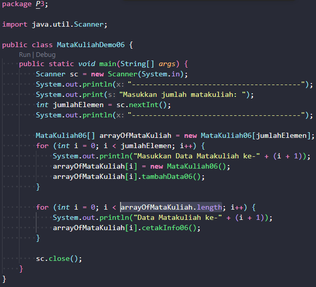 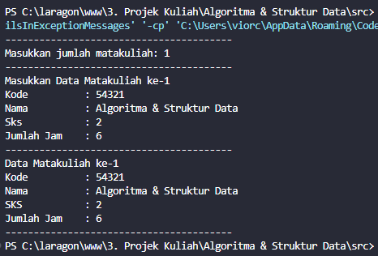
