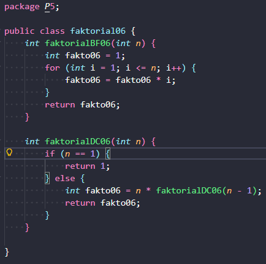

|            | Algorithm and Data Structure |
| ---------- | ---------------------------- |
| NIM        | 254107020055                 |
| Nama       | Caesar Vior Byrnanda         |
| Kelas      | TI - 1F                      |
| Repository | [link] ()                    |

# JobSheet 5 #5 BRUTE FORCE DAN DIVIDE CONQUER

# Percobaan 1: Screenshot hasil percobaan

## Pertanyaan

### 1: Pada base line Algoritma Divide Conquer untuk melakukan pencarian nilai faktorial, jelaskan perbedaan bagian kode pada penggunaan if dan else!

Fungsi if adalah untuk menjadi rem agar tidak terjadi pemanggilan fungsi yang tidak ada batasnya. Sedangkan, else berfungsi untuk memanggil fungsi itu sendiri dan menjadi logikanya. Mudahnya, if itu adalah sebuah validasi sebelum else mengekseksui parameternya.

### 2: Apakah memungkinkan perulangan pada method faktorialBF() diubah selain menggunakan for? Buktikan!
