|            | Algorithm and Data Structure                                 |
| ---------- | ------------------------------------------------------------ |
| NIM        | 254107020055                                                 |
| Nama       | Caesar Vior Byrnanda                                         |
| Kelas      | TI - 1F                                                      |
| Repository | https://github.com/CaesarVior/PrakASD_1F_06/tree/main/src/P5 |

# JobSheet 5 #5 BRUTE FORCE DAN DIVIDE CONQUER

# Percobaan 1: Screenshot hasil percobaan

Class faktorial

Main faktorial
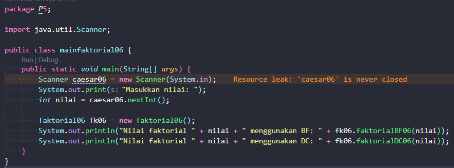

## Pertanyaan

### 1: Pada base line Algoritma Divide Conquer untuk melakukan pencarian nilai faktorial, jelaskan perbedaan bagian kode pada penggunaan if dan else!

Fungsi if adalah untuk menjadi rem agar tidak terjadi pemanggilan fungsi yang tidak ada batasnya. Sedangkan, else berfungsi untuk memanggil fungsi itu sendiri dan menjadi logikanya. Mudahnya, if itu adalah sebuah validasi sebelum else mengekseksui parameternya.

### 2: Apakah memungkinkan perulangan pada method faktorialBF() diubah selain menggunakan for? Buktikan!

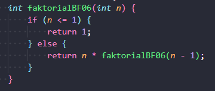

Bisa dengan merubah struktur kode seperti diatas.

### 3: Jelaskan perbedaan antara fakto _= i; dan int fakto = n _ faktorialDC(n-1); !

`fakto *=1;` merupakan hasil pencarian faktorial tetapi menggunakan for loop atau Brute Force. Sedangkan ` int fakto = n * faktorialDC(n-1);` merupakan pencarian faktorial tetapi menggunakan fungsi rekursif atau Divide Conquer

### 4: Buat Kesimpulan tentang perbedaan cara kerja method faktorialBF() dan faktorialDC()!

`faktorialBF()` menggunakan pendekatan brute force, tetapi cara ini tidak disarankan jika bilangan sudah besar. Sedangkan `faktorialDC()` menggunakan pendekatan divide conquer. Pendekatan ini merupakan cara yang paling sesuai jika berkaitan dengan aritmatika yang memiliki jumlah cukup besar.

# Percobaan 2: Screenshot hasil percobaan

Class Pangkat
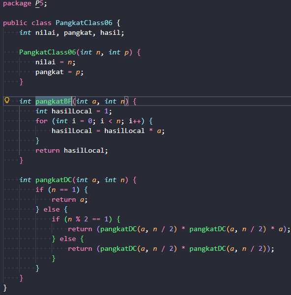

Main Pangkat
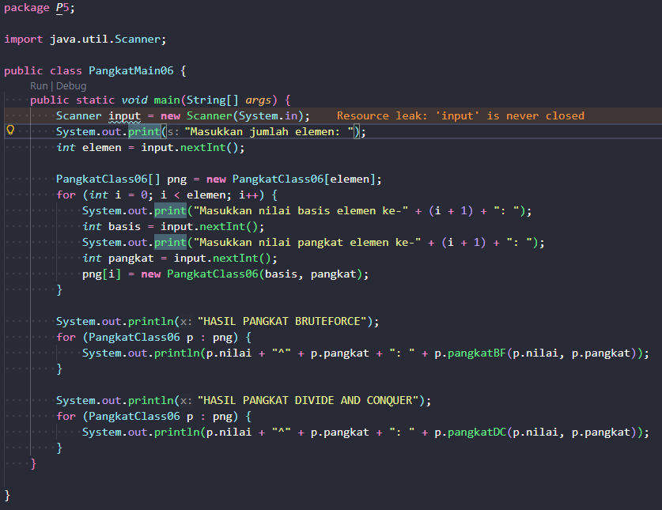

Hasil
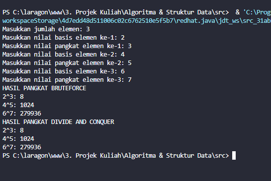

## Pertanyaan

### 1. Jelaskan mengenai perbedaan 2 method yang dibuat yaitu pangkatBF() dan pangkatDC()!

`pangkatBF()` menggunakan metode perulangan biasa yaitu menggunakan perulangan for untuk mengalikan basis (a) dengan dirinya sendiri secara berurutan sebanyak nilai pangkat (b)

`pangkatDC()` menggunakan pendekatan dengan memanggil fungsi nya sendiri didalam logika nya. Method ini memecah masalah dengan cara membagi nilai pangkat (n) menjadi dua secara terus-menerus hingga mencapai basis kasus (n == 1). Setelah itu, hasil pecahan digabungkan kembali dengan cara dikalikan.

### 2. Apakah tahap combine sudah termasuk dalam kode tersebut?Tunjukkan!

Ada, Tahap combine terjadi ketika hasil dari pemanggilan method secara rekursif (pada fungsi Divide and Conquer) dikalikan satu sama lain untuk mendapatkan hasil akhir dari pemecahan masalah tersebut. Buktinya dapat dilihat dari logika

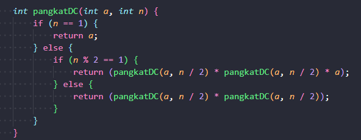

Jika pangkat ganjil: return (pangkatDC(a, n / 2) _ pangkatDC(a, n / 2) _ a);
Jika pangkat genap: return (pangkatDC(a, n / 2) \* pangkatDC(a, n / 2));

### 3. Pada method pangkatBF()terdapat parameter untuk melewatkan nilai yang akan dipangkatkan dan pangkat berapa, padahal di sisi lain di class Pangkat telah ada atribut nilai dan pangkat, apakah menurut Anda method tersebut tetap relevan untuk memiliki parameter? Apakah bisa jika method tersebut dibuat dengan tanpa parameter? Jika bisa, seperti apa method pangkatBF() yang tanpa parameter?

Karena atribut nilai dan pangkat sudah ada didalam class dan diisi melalui parameter pada method `pangkatBF(int a, int n)` malah membuat nya menjadi redundan. Jika ingin dibuat tanpa parameter maka akan menjadi sangat bisa. Karena, method akan langsung mengambil nilai dari atribut class tersebut.

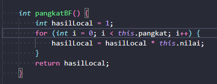

### 4. Tarik tentang cara kerja method pangkatBF() dan pangkatDC()!

Cara kerja `pangkatBF():` Mengalikan bilangan dengan cara satu per satu dari awal hingga akhir. Cara ini mudah dipahami tetapi memakan waktu dan resource yang lebih lama jika nilai pangkatnya sangat besar (kompleksitas waktu linier).

Cara kerja `pangkatDC():` Memecah pangkat menjadi setengahnya untuk mengurangi jumlah operasi perkalian yang perlu dilakukan, lalu menggabungkan hasilnya. Cara ini jauh lebih bagus dan efisien untuk terutama untuk menghitung pangkat dengan angka yang sangat besar.

# Percobaan 3: Screenshot hasil percobaan

Class Pangkat
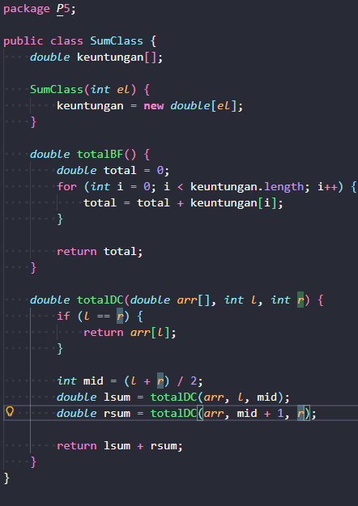

Main Pangkat
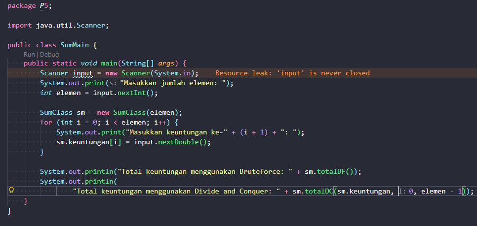

Hasil
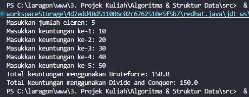

### 1. Kenapa dibutuhkan variable mid pada method TotalDC()?

mid berfungsi untuk mencari indeks atau posisi tengah antara lsum (left sum) dan rsum (right sum). Setelah ditemukan program bisa menggunakannya sebagai ambang batas untuk memecah masalah menjadi dua bagian kecil yang nantinya akan dihitung secara bersamaan. Mid juga membatasi rentang data yang akan dihitung agar semakin mengecil pada setiap pemanggilan method.

### 2. Untuk apakah statement di bawah ini dilakukan dalam TotalDC()?

`double lsum = totalDC(arr, l, mid);` berfungsi untuk menghitung total nilai (sum) dari elemen array disebelah kiri (lsum). Rentang data yang dihitung adalah dari batas awal (l) sampai ke titik tengah (mid)

`double rsum = totalDC(arr, mid+1, r);` berfungsi untuk menghitung total nilai (sum) dari elemen array disebelah kanan (rsum). Rentang data yang dihitung adalah dari elemen setelah titik tengah (mid + 1) sampai ke batas akhir (r).

### 3. Kenapa diperlukan penjumlahan hasil lsum dan rsum seperti di bawah ini?

Untuk menjumlah total keselurahan dari elemen array sebelah kanan (rsum) dan kiri (lsum) dan menghasilkan satu hasil (return).

### 4. Apakah base case dari totalDC()?

`if (l == r) {
            return arr[l];
        }`

yaitu ketika elemen array indeks sebelah kiri(lsum) dan indeks sebelah kanan (rsum) berada dalam posisi yang sama persis.

### 5. Tarik Kesimpulan tentang cara kerja totalDC()

Pertama adalah program mengecek apakah array sudah tidak bisa dibagi lagi (base case). Kedua, adalah fase pembagian Jika array masih berisi lebih dari 1 elemen, program akan mencari indeks tengahnya dengan rumus mid = (l + r) / 2 dan titik mid digunakan untuk membelah array menjadi 2. Ketiga, merupakan fase program memanggil dirinya sendiri secara terus menerus untuk memecah dan menghitung array dibagian kiri dan array bagian kanan. Keempat, adalah fase penggambungan (combine) yaitu ketika base case sudah tercapai kode akan langsung menjumlahkan rsum dan lsum.

# Tugas: Screenshot hasil percobaan

Class
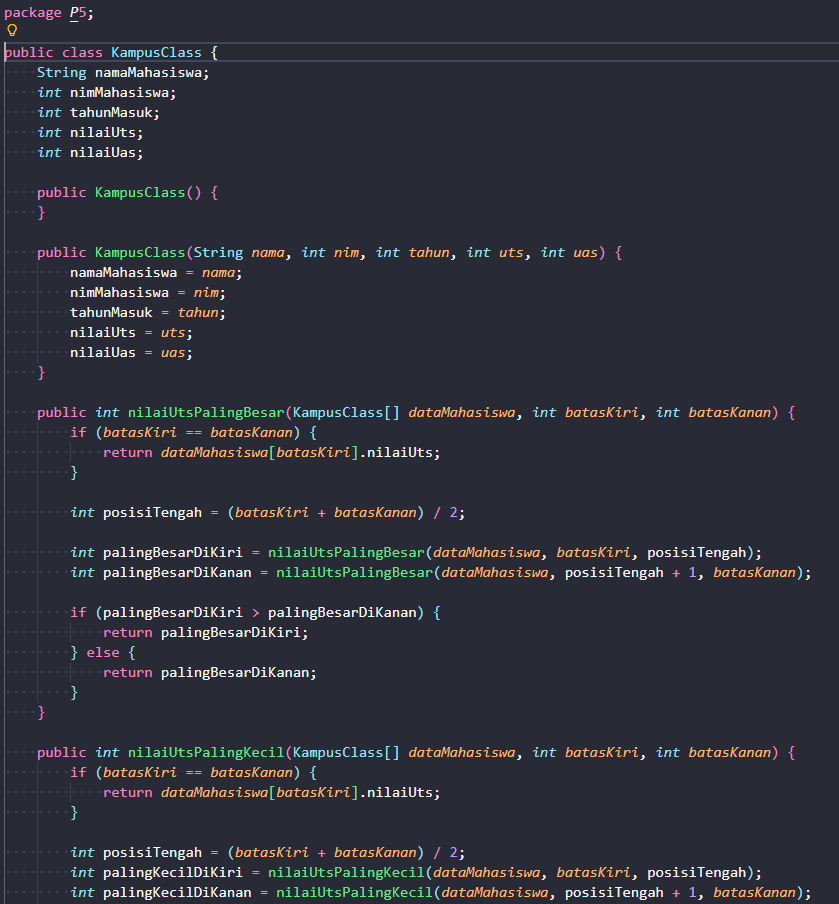
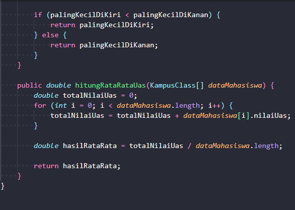

Main
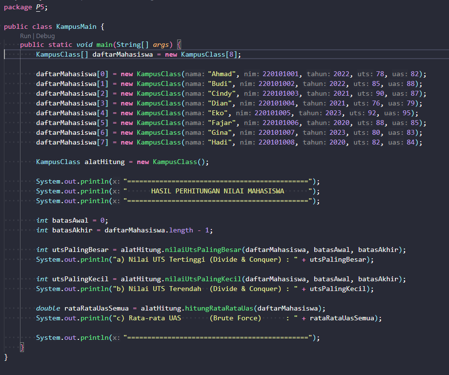

Hasil
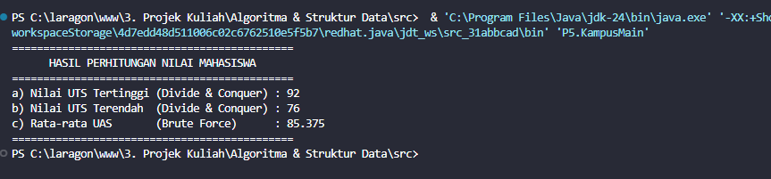
