|            | Algorithm and Data Structure                                 |
| ---------- | ------------------------------------------------------------ |
| NIM        | 254107020055                                                 |
| Nama       | Caesar Vior Byrnanda                                         |
| Kelas      | TI - 1F                                                      |
| Repository | https://github.com/CaesarVior/PrakASD_1F_06/tree/main/src/P6 |

# JOBSHEET - 5 SORTING (BUBBLE, SELECTION, DAN INSERTION SORT)

# Percobaan 1: Screenshot hasil percobaan

Class Sorting (BUBBLE SORT)
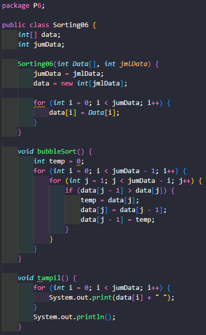

Main Sorting (BUBBLE SORT)
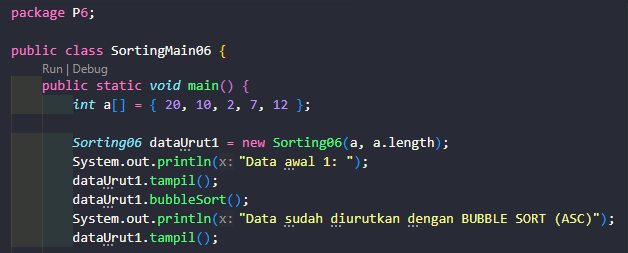

Class Sorting (SELECTION SORT)
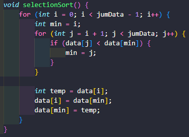

Main Sorting (SELECTION SORT)
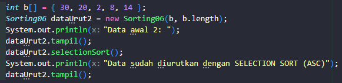

Class Sorting (INSERTION SORT)
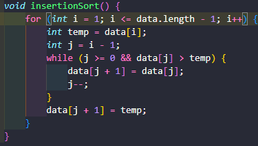

Main Sorting (INSERTION SORT)
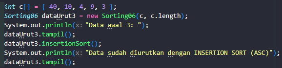

Hasil Percobaan
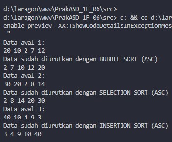

## Pertanyaan

### 1: Jelaskan fungsi kode program berikut

Kode tersebut adalah logika Swap dalam algoritma sorting. Tujuannya adalah untuk memindahkan elemen yang nilainya lebih besar ke arah kanan (indeks lebih tinggi) agar data menjadi urut secara mengecil ke membesar (ascending).

### 2. Tunjukkan kode program yang merupakan algoritma pencarian nilai minimum pada selection sort!

```
void selectionSort() {
    for (int i = 0; i < jumData - 1; i++) {
        int min = i;
        for (int j = i + 1; j < jumData; j++) {
            if (data[j] < data[min]) {
                min = j;
            }
        }

        int temp = data[i];
        data[i] = data[min];
        data[min] = temp;
    }
}
```

Kode tersebut menunjukkan algoritma dan pencarian nilai minimum pada selection sort.

### 3. Pada Insertion sort , jelaskan maksud dari kondisi pada perulangan

Fungsi while berfungsi untuk menggeser (shifting) semua angka yang "lebih besar" ke kanan agar si angka "kecil" (temp) bisa disisipkan ke posisi yang benar di deretan angka yang sudah terurut.

### 4. Pada Insertion sort, apakah tujuan dari perintah

Fungsinya adalah untuk menggeser data ke kanan agar tersedia tempat kosong bagi elemen yang sedang diurutkan (temp).

# Praktikum 2: Screenshot hasil percobaan

Constructor Mahasiswa
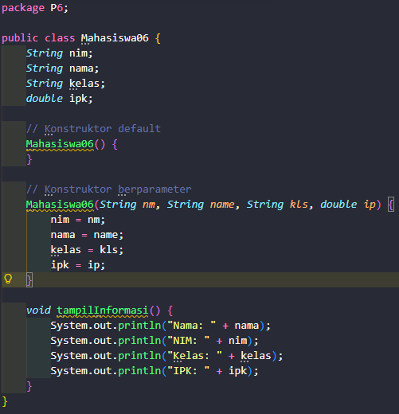

Class Mahasiswa
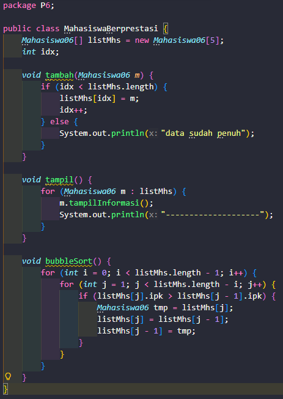

Main Mahasiswa
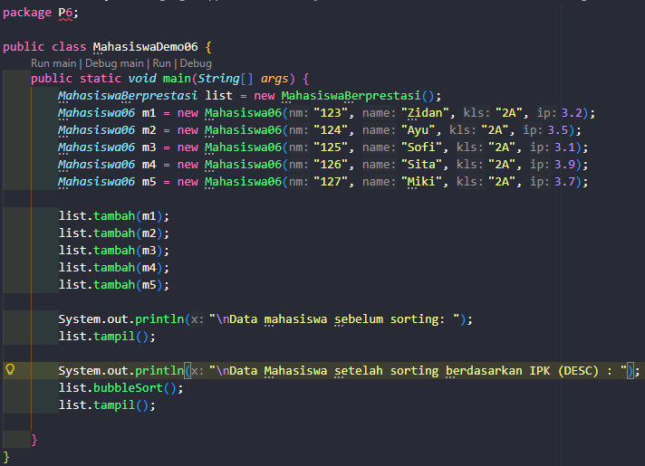

Hasil Percobaan
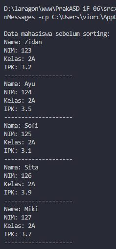 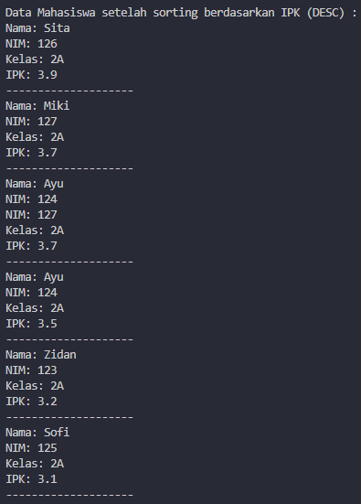

## Pertanyaan

### 1. Perhatikan perulangan di dalam bubbleSort():

    a. Mengapa syarat dari perulangan i adalah i < listMhs.length - 1?
       Karena perulangan i (outer looping) menentukan jumlah tahap program mulai dari data ke-1, membandingkannya dengan data ke-2 yang dibutuhkan untuk mengurutkan seluruh elemen. Untuk array berisi N elemen, dibutuhkan paling banyak N-1 tahapan pembandingan agar semua data dapat terurut dengan benar.

    b. Mengapa syarat dari perulangan j adalah j < listMhs.length - i?
       Karena pada setiap tahap program mulai dari data ke-1, membandingkannya dengan data ke-2 sebanyak i elemen di posisi paling belakang pasti sudah terurut dan menempati posisi yang benar. Sehingga, tidak perlu membandingkan elemen-elemen di posisi tersebut lagi (batas akhirnya terus dikurangi sebesar i).

    c. Jika banyak data di dalam listMhs adalah 50, maka berapa kali perulangan i akan berlangsung? Dan ada berapa tahap bubble sort yang ditempuh?
