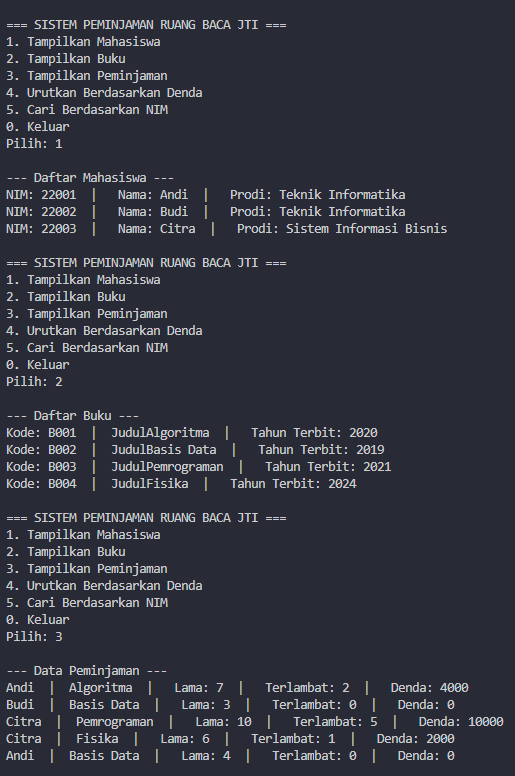
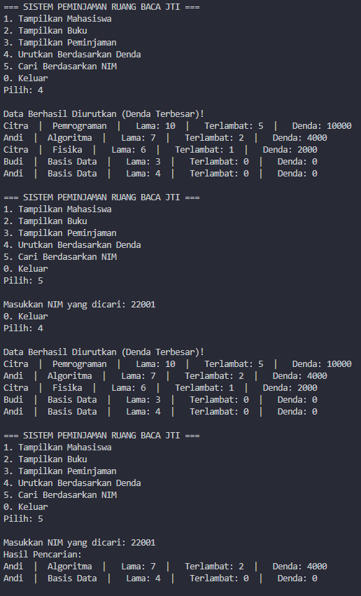
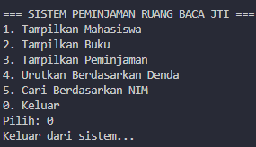

|            | Algorithm and Data Structure                                    |
| ---------- | --------------------------------------------------------------- |
| NIM        | 254107020055                                                    |
| Nama       | Caesar Vior Byrnanda                                            |
| Kelas      | TI - 1F                                                         |
| Repository | https://github.com/CaesarVior/PrakASD_1F_06/tree/main/src/P7/CM |

# CM 1 Studi Kasus

Class Sorting (BUBBLE SORT)


Main Sorting (BUBBLE SORT)


Class Sorting (SELECTION SORT)


```
package P7.CM;

import java.util.Scanner;

public class ManajemenBuku06 {
    public static void main(String[] args) {
        Scanner sc = new Scanner(System.in);
        int choices06;

        Mahasiswa06[] mahasiswa06 = {
                new Mahasiswa06("22001", "Andi", "Teknik Informatika"),
                new Mahasiswa06("22002", "Budi", "Teknik Informatika"),
                new Mahasiswa06("22003", "Citra", "Sistem Informasi Bisnis")
        };

        Buku06[] buku06 = {
                new Buku06("B001", "Algoritma", 2020),
                new Buku06("B002", "Basis Data", 2019),
                new Buku06("B003", "Pemrograman", 2021),
                new Buku06("B004", "Fisika", 2024)
        };

        Peminjaman06[] peminjaman06 = {
                new Peminjaman06(mahasiswa06[0], buku06[0], 7),
                new Peminjaman06(mahasiswa06[1], buku06[1], 3),
                new Peminjaman06(mahasiswa06[2], buku06[2], 10),
                new Peminjaman06(mahasiswa06[2], buku06[3], 6),
                new Peminjaman06(mahasiswa06[0], buku06[1], 4),
        };

        // Hitung denda di awal supaya data denda tidak nol saat ditampilkan/diurutkan
        for (Peminjaman06 p : peminjaman06) {
            p.hitungDenda();
        }

        do {
            System.out.println("\n=== SISTEM PEMINJAMAN RUANG BACA JTI ===");
            System.out.println("1. Tampilkan Mahasiswa");
            System.out.println("2. Tampilkan Buku");
            System.out.println("3. Tampilkan Peminjaman");
            System.out.println("4. Urutkan Berdasarkan Denda");
            System.out.println("5. Cari Berdasarkan NIM");
            System.out.println("0. Keluar");
            System.out.print("Pilih: ");

            choices06 = sc.nextInt();
            sc.nextLine(); // Penting: Membersihkan buffer agar input NIM tidak terlewati

            switch (choices06) {
                case 1:
                    System.out.println("\n--- Daftar Mahasiswa ---");
                    for (Mahasiswa06 s : mahasiswa06) {
                        s.tampilMahasiswa06();
                    }
                    break;

                case 2:
                    System.out.println("\n--- Daftar Buku ---");
                    for (Buku06 b : buku06) {
                        b.tampilBuku06();
                    }
                    break;

                case 3:
                    System.out.println("\n--- Data Peminjaman ---");
                    for (Peminjaman06 p : peminjaman06) {
                        p.tampilPeminjaman();
                    }
                    break;

                case 4:
                    // Insertion Sort: Urutkan denda dari tertinggi ke terendah
                    for (int i = 1; i < peminjaman06.length; i++) {
                        Peminjaman06 temp = peminjaman06[i];
                        int j = i - 1;
                        while (j >= 0 && peminjaman06[j].denda < temp.denda) {
                            peminjaman06[j + 1] = peminjaman06[j];
                            j--;
                        }
                        peminjaman06[j + 1] = temp;
                    }
                    System.out.println("\nData Berhasil Diurutkan (Denda Terbesar)!");
                    for (Peminjaman06 p : peminjaman06) {
                        p.tampilPeminjaman();
                    }
                    break;

                case 5:
                    System.out.print("\nMasukkan NIM yang dicari: ");
                    String cariNim = sc.nextLine();
                    boolean ditemukan = false;

                    System.out.println("Hasil Pencarian:");
                    for (Peminjaman06 p : peminjaman06) {
                        // Memanggil atribut 'nim' dari dalam objek 'student' (Peminjaman06)
                        if (p.student.nim.equalsIgnoreCase(cariNim)) {
                            p.tampilPeminjaman();
                            ditemukan = true;
                        }
                    }

                    if (!ditemukan) {
                        System.out.println("Data dengan NIM " + cariNim + " tidak ditemukan.");
                    }
                    break;

                case 0:
                    System.out.println("Keluar dari sistem...");
                    break;

                default:
                    System.out.println("Pilihan tidak valid!");
            }
        } while (choices06 != 0);

        sc.close();
    }
}

```
