|            | Algorithm and Data Structure                                          |
| ---------- | --------------------------------------------------------------------- |
| NIM        | 254107020055                                                          |
| Nama       | Caesar Vior Byrnanda                                                  |
| Kelas      | TI - 1F                                                               |
| Repository | https://github.com/CaesarVior/PrakASD_1F_06/tree/main/src/P7/Jobsheet |

# JOBSHEET VI SEARCHING

# Percobaan 1: Sequential Search

Hasil Percobaan
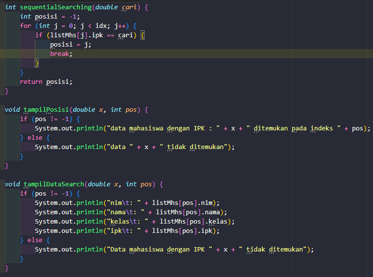
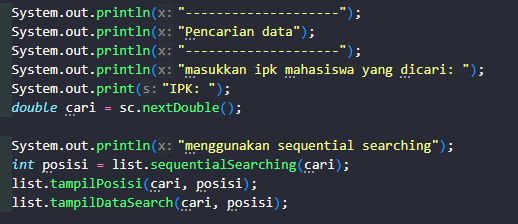

Hasil Running
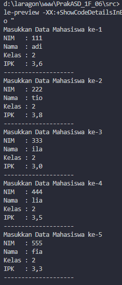
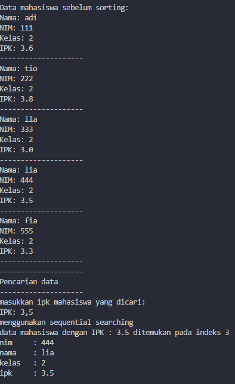

## Pertanyaan

### 1. Jelaskan perbedaan method tampilDataSearch dan tampilPosisi pada class MahasiswaBerprestasi!

tampilPosisi: Hanya menampilkan informasi letak index array di mana data tersebut ditemukan.

tampilDataSearch: Menampilkan secara detail seluruh atribut (NIM, Nama, Kelas, IPK) dari mahasiswa pada index yang ditemukan tersebut.

### 2. Jelaskan fungsi break pada kode program di bawah ini!

Perintah break berfungsi untuk menghentikan perulangan (looping) secara paksa. Dalam Sequential Search, jika data yang dicari sudah ditemukan, kita tidak perlu mengecek sisa data di belakangnya lagi. Ini membuat algoritma lebih efisien.

### 3. Apa fungsi variabel pos atau indeks hasil pencarian dalam program sequential search?

Variabel pos berfungsi untuk menyimpan letak indeks (posisi) elemen array yang nilainya cocok dengan data yang dicari. Nilai indeks ini nantinya digunakan untuk memanggil dan menampilkan data dari array (misal: listMhs[pos].nama). Jika data tidak ditemukan, nilainya akan tetap -1.

### 4. Jika terdapat lebih dari satu data dengan nilai yang sama, hasil pencarian sequential search yang dibuat di atas akan menampilkan data ke berapa? Jelaskan.

Akan menampilkan data yang pertama kali ditemukan (data dengan indeks terkecil yang cocok). Hal ini terjadi karena ada perintah break. Begitu program menemukan kecocokan pertama, perulangan langsung dihentikan sehingga data kembar di indeks selanjutnya tidak akan terdeteksi.

### 5. Berkaitan dengan pertanyaan nomor 2 di atas, apa yang terjadi jika perintah break dihapus dari kode di atas?

Jika break dihapus, perulangan akan terus berjalan sampai elemen terakhir array meskipun data sudah ditemukan. Akibatnya, jika ada data yang nilainya sama (kembar), variabel posisi akan terus ditimpa (di- overwrite). Sehingga, program akan menampilkan data kembar yang letaknya paling akhir (indeks terbesar).

# Percobaan 1: Binary Search

Hasil Percobaan
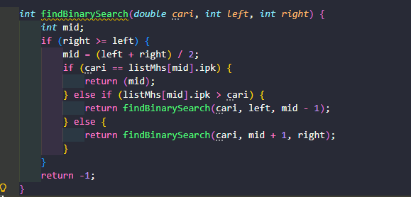
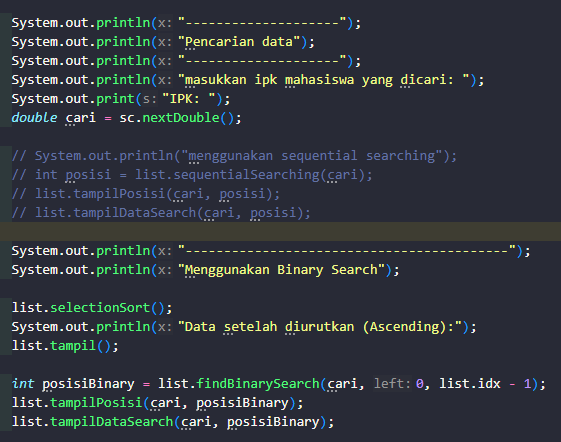

Hasil Running
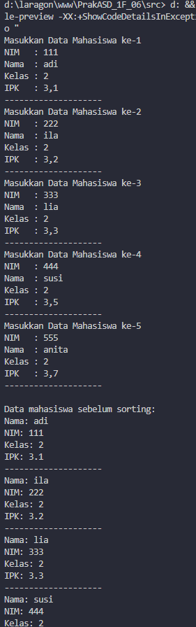
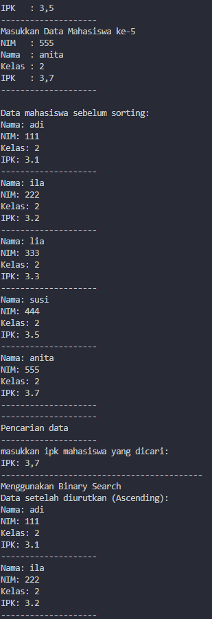
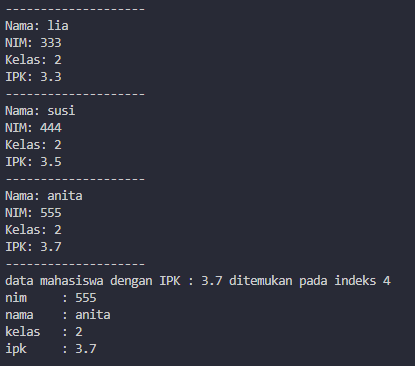

## Pertanyaan

### 1. Tunjukkan pada kode program yang mana proses divide dijalankan!

Proses divide (pembagian) terjadi pada baris:
`mid = (left + right) / 2;`
Di sini, rentang pencarian dibagi menjadi dua bagian dengan menentukan titik tengahnya.

### 2. Tunjukkan pada kode program yang mana proses conquer dijalankan!

Proses conquer (penyelesaian) terjadi saat pemanggilan rekursif: `return findBinarySearch(cari, left, mid - 1);` (mencari di bagian kiri) dan `return findBinarySearch(cari, mid + 1, right);` (mencari di bagian kanan)

### 3. Apa fungsi left, right, dan mid?

left: Menyimpan indeks batas kiri (awal) dari rentang pencarian.
right: Menyimpan indeks batas kanan (akhir) dari rentang pencarian.
mid: Menyimpan indeks nilai tengah, yang digunakan sebagai patokan untuk membandingkan apakah data sudah ditemukan atau harus mencari ke kiri/kanan.

### 4. Jika data IPK yang dimasukkan tidak urut. Apakah program masih dapat berjalan? Mengapa demikian?

Program akan tetap berjalan (tidak error), tetapi hasilnya bisa salah atau tidak ditemukan. Hal ini dikarenakan prinsip dasar Binary Search adalah mengeliminasi setengah bagian data berdasarkan perbandingan nilai tengah. Jika data acak, sistem tidak bisa menentukan apakah data yang dicari ada di sebelah kiri atau kanan nilai tengah tersebut.

### 5.Jika IPK yang dimasukkan dari IPK terbesar ke terkecil (Descending), algoritma di atas harus diubah di bagian mana?

Perlu diubah pada bagian pembanding arah pencariannya: Ubah `else if (listMhs[mid].ipk > cari)` menjadi `else if (listMhs[mid].ipk < cari)` Atau dengan kata lain, tukar logika pencarian ke kiri dan ke kanannya karena urutan datanya terbalik.

### 6. Jelaskan bagaimana binary search menentukan bahwa data yang dicari tidak ditemukan di dalam array.

Binary search menentukan data tidak ditemukan jika kondisi right >= left sudah tidak terpenuhi (nilai left menjadi lebih besar dari right).
Hal ini terjadi setelah proses pembagian data dilakukan berulang kali namun nilai yang dicari tidak ditemukan pada setiap titik tengah (mid). Ketika rentang pencarian terus dipersempit hingga habis dan kedua batas tersebut bersilangan, fungsi akan berhenti dan mengembalikan nilai -1 sebagai penanda bahwa data tidak ada dalam array.

### 7. Modifikasi program di atas yang mana jumlah mahasiswa yang diinputkan sesuai dengan masukan dari keyboard.

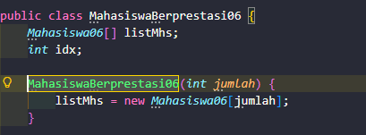
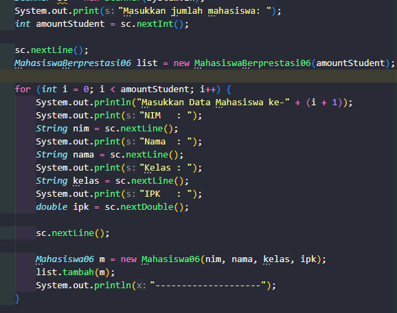
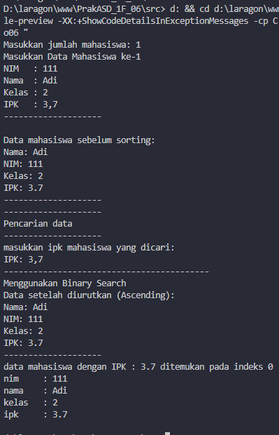
