|            | Algorithm and Data Structure                                           |
| ---------- | ---------------------------------------------------------------------- |
| NIM        | 254107020055                                                           |
| Nama       | Caesar Vior Byrnanda                                                   |
| Kelas      | TI - 1F                                                                |
| Repository | https://github.com/CaesarVior/PrakASD_1F_06/blob/main/src/P9/REPORT.md |

# JOBSHEET IX STACK

# Percobaan 1

# Hasil Percobaan

### Class Mahasiswa06

### Class StackTugasMahasiswa06

### Class Utama (Main)

# Hasil Running

## Pertanyaan

### 1. Lakukan perbaikan pada kode program, sehingga keluaran yang dihasilkan sama dengan verifikasi hasil percobaan! Bagian mana yang perlu diperbaiki?

Pada bagian class StackTugasMahasiswa06.java yang perlu dirubah karena, perulangan tersebut berjalan maju yang ditandai dengan i++. Untuk, menyesuaikan maka harus diganti perulangan nya menjadi seperti pada gambar:

### 2. Berapa banyak data tugas mahasiswa yang dapat ditampung di dalam Stack? Tunjukkan potongan kode programnya!

Data yang dapat ditampung hanya 5, sesuai dengan potongan kode
`StackTugasMahasiswa06 stack = new StackTugasMahasiswa06(5);`

### 3. Mengapa perlu pengecekan kondisi !isFull() pada method push? Kalau kondisi if-else tersebut dihapus, apa dampaknya?

Untuk mengecek apakah array/stack sudah penuh atau tidak kapasitasnya. Sehingga data baru yang akan dimasukkan tidak bisa ditambahkan lagi. Jika dihapus maka akan ada error karena datanya tidak bisa ditampung lagi atau bisa disebut Stack Overflow.

### 4. Modifikasi kode program pada class MahasiswaDemo dan StackTugasMahasiswa sehingga pengguna juga dapat melihat mahasiswa yang pertama kali mengumpulkan tugas melalui operasi lihat tugas terbawah!

Menambahkan class baru di `StackTugasMahasiswa06.java` agar bisa melihat data pertama yang dimasukkan. Sehingga ditambahkan menu baru untuk melihat data pertama.
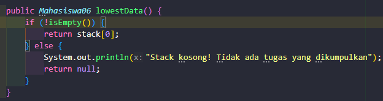
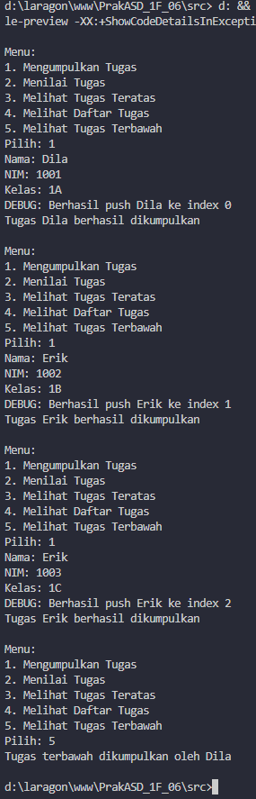

### 5. Tambahkan method untuk dapat menghitung berapa banyak tugas yang sudah dikumpulkan saat ini, serta tambahkan operasi menunya!

## Class Mahasiswa Demo untuk Menu yang Ditambahkan

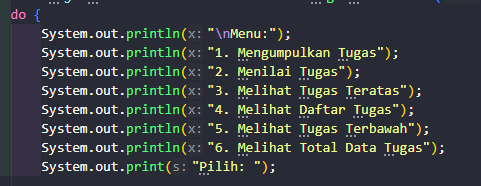
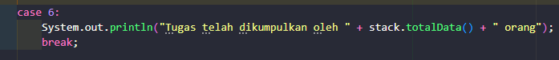

## Class Stack Tugas Mahasiswa

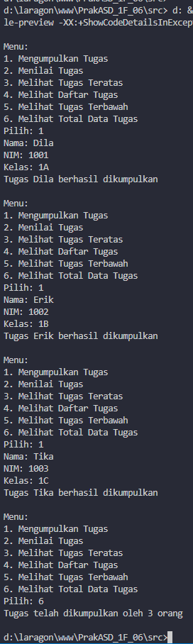

## Hasil Percobaan

# Percobaan 2

# Hasil Percobaan

### Class StackKonversi06

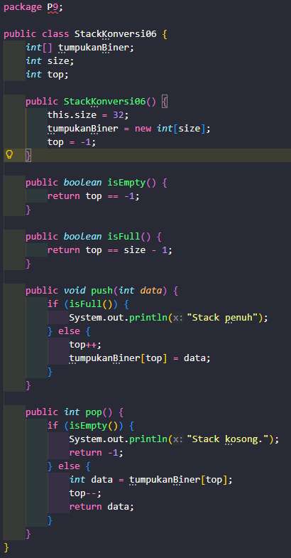

### Class StackTugasMahasiswa06

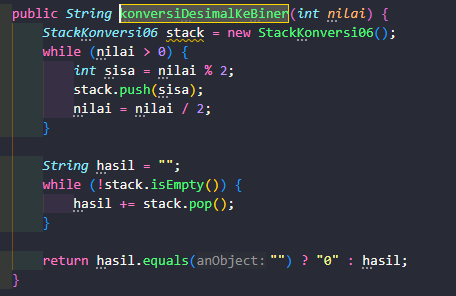

# Hasil Running

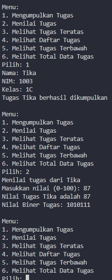

## Pertanyaan

### 1. Jelaskan alur kerja dari method konversiDesimalKeBiner!

Ketika user memilih menu nomor 2 pada `MahasiswaDemo06.java` akan dihasilkan nilai dari mahasiswa yang dihitung di `MahasiswaDemo06.java` method `tugasDinilai`. Lalu ketika nilai sudah didapatkan maka akan ada variabel nilai yang dikirimkan ke Class `StackTugasMahasiswa06.java` method `konversiDesimalKeBiner`. Dari method tersebut, akan memanggil class `StackKonversi06` untuk membuat stack baru. Lalu didalam Class `StackTugasMahasiswa06.java` method `konversiDesimalKeBiner` akan dihitung menggunakan perulangan berapa binernya dengan kondisi ketika `nilai > 0` maka akan dihitung terus binernya.

### 1. Pada method konversiDesimalKeBiner, ubah kondisi perulangan menjadi while (kode != 0), bagaimana hasilnya? Jelaskan alasannya!

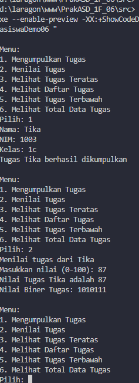

Hasilnya tidak ada masalah, kecuali jika user salah memasukkan yang menyebabkan nilainya menjadi minus.

# Tugas

# Hasil Percobaan

### Class Surat06

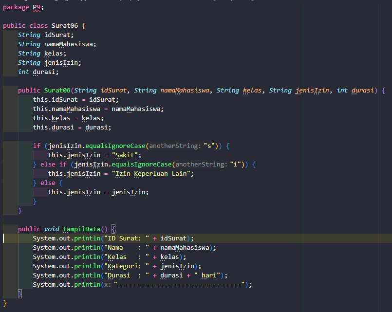

### Class StackSurat06

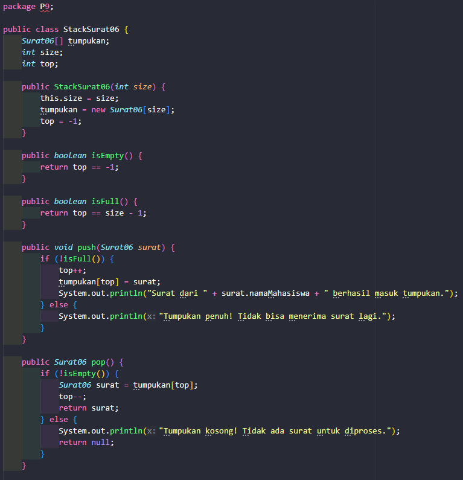
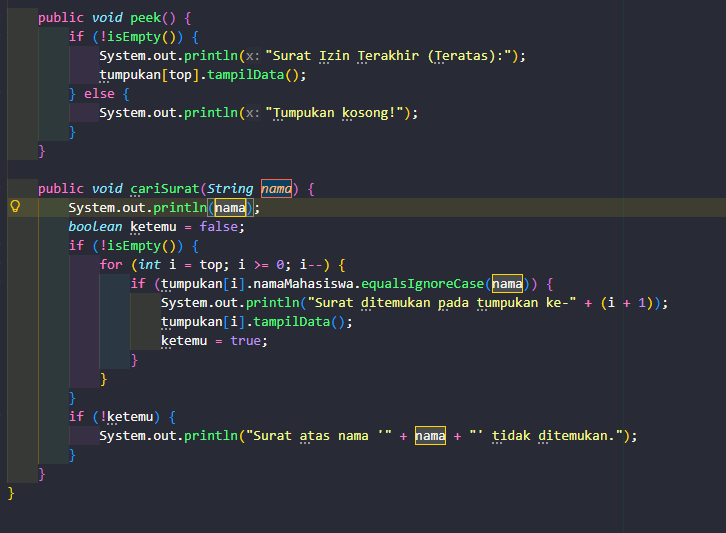

### Class MainSurat06

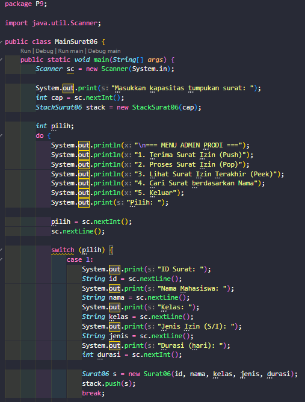
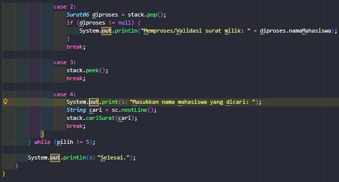

# Hasil Running

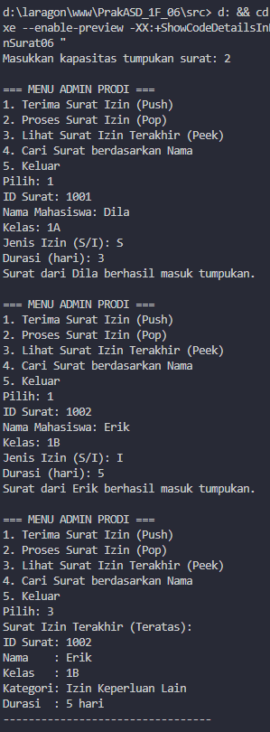
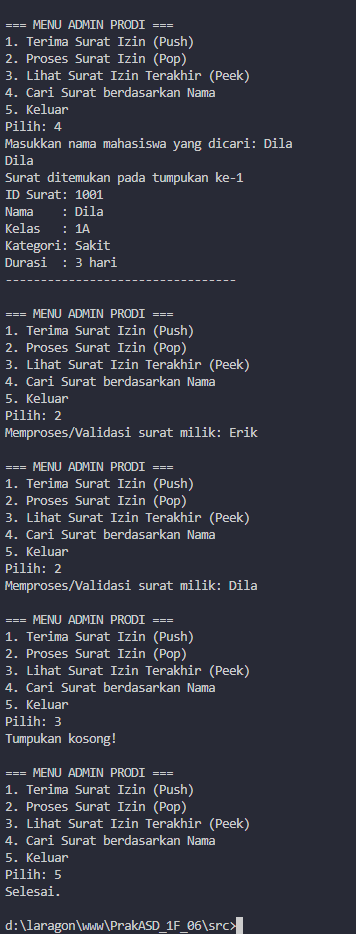
