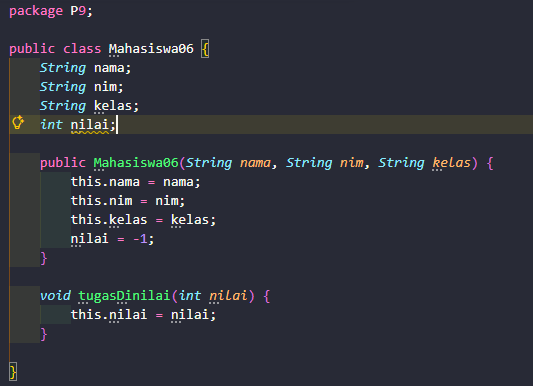
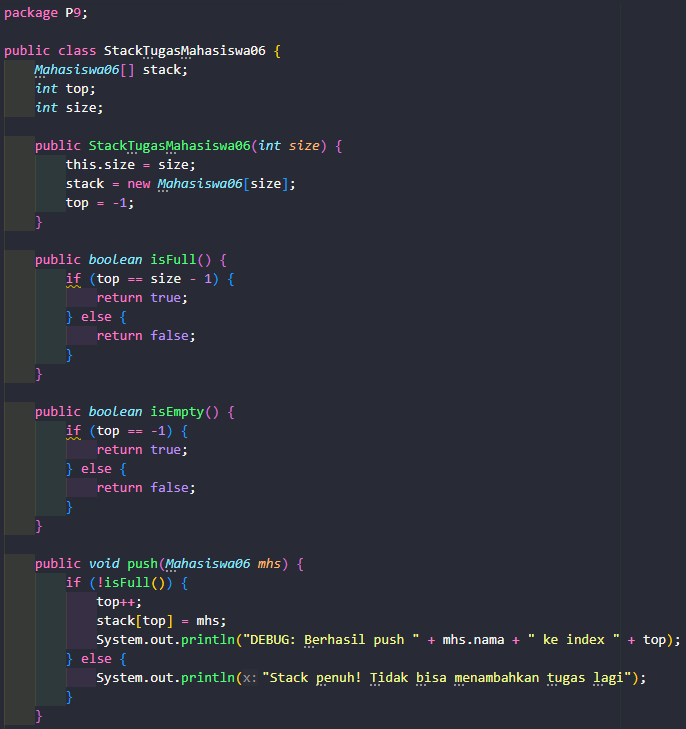
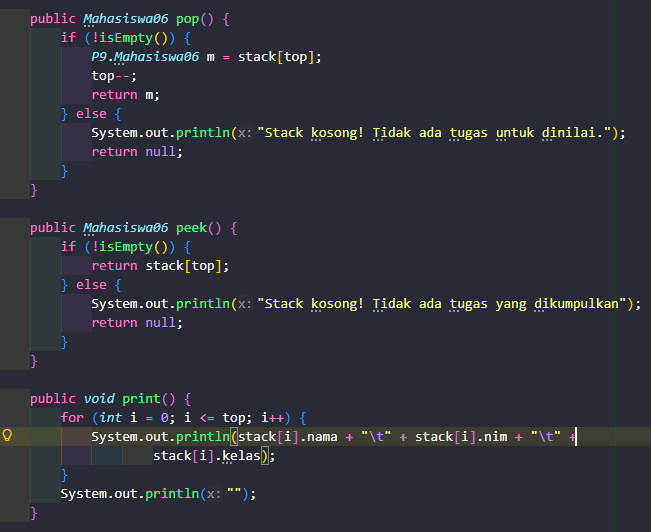
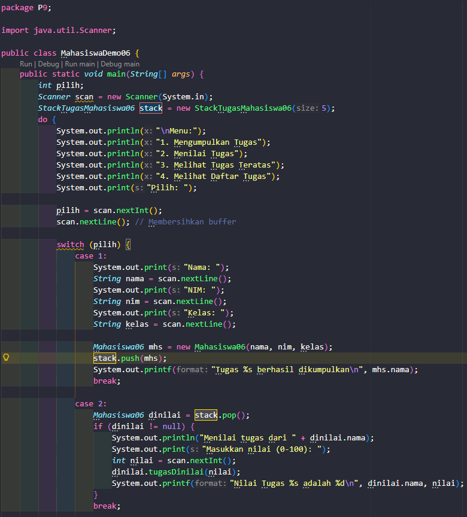
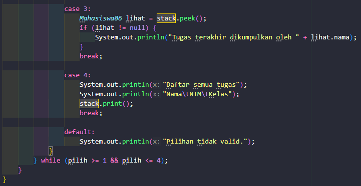
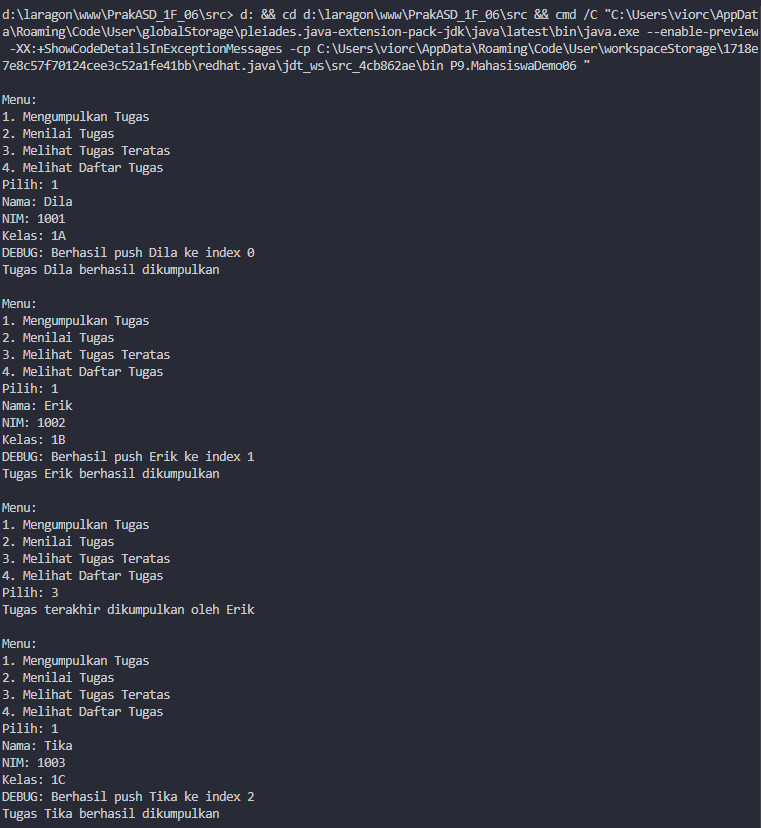
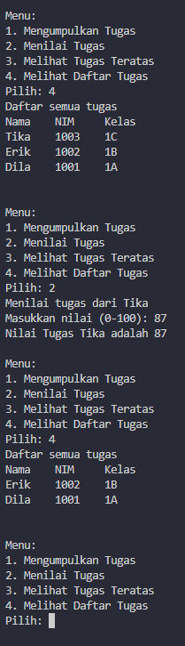
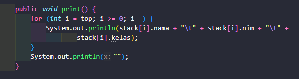

|            | Algorithm and Data Structure                                         |
| ---------- | -------------------------------------------------------------------- |
| NIM        | 254107020055                                                         |
| Nama       | Caesar Vior Byrnanda                                                 |
| Kelas      | TI - 1F                                                              |
| Repository | https://github.com/CaesarVior/PrakASD_1F_06/tree/main/src/9/Jobsheet |

# JOBSHEET IX STACK

# Percobaan 1

# Hasil Percobaan

### 1.1 Class Mahasiswa06

Class ini berfungsi sebagai model data untuk menyimpan atribut mahasiswa.

### 1.2 Class StackTugasMahasiswa06

Class ini mengimplementasikan struktur data Stack menggunakan array.

### 1.3 Class Utama (Main)

Class ini menangani antarmuka menu dan input user.

# Hasil Running

## Pertanyaan

### 1. Lakukan perbaikan pada kode program, sehingga keluaran yang dihasilkan sama dengan verifikasi hasil percobaan! Bagian mana yang perlu diperbaiki?

Pada bagian class StackTugasMahasiswa06.java yang perlu dirubah karena, perulangan tersebut berjalan maju yang ditandai dengan i++. Untuk, menyesuaikan maka harus diganti perulangan nya menjadi seperti pada gambar:

